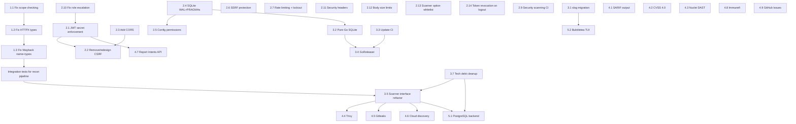

# Modernization, Gap Remediation, and Future Positioning

## Enhancement Summary

**Deepened on:** 2026-02-12
**Research agents used:** 7 (security-sentinel, architecture-strategist, performance-oracle, data-migration-expert, framework-docs-researcher, best-practices-researcher, pattern-recognition-specialist)

### Key Improvements from Research
1. **11 new security vulnerabilities discovered** — including CRITICAL open registration role escalation and HIGH command injection via scanner options
2. **CSRF approach invalidated** — double-submit cookie is wrong for Bearer token APIs; should remove or redesign
3. **5 SSRF bypass classes identified** — DNS rebinding, IPv6 mapped addresses, URL parser inconsistencies, decimal/octal IP, redirects
4. **SQLite performance configuration deepened** — busy_timeout=10000, cache_size=-20000, mmap_size=268435456, batch INSERTs 10-50x faster
5. **Driver swap is NOT drop-in** — 5 code locations, driver name "sqlite" not "sqlite3", error string compatibility risk, `_pragma=name(value)` DSN syntax
6. **Scanner interface expanded** — 5 typed interfaces recommended (not 4), add PortScanner + ScannerMeta base
7. **Complete implementation code provided** — slog RedactingHandler, .goreleaser.yaml with cosign/SBOM, modernc.org/sqlite DSN format

### New Critical Items Discovered
- **CRITICAL:** Anyone can register as admin via `{"role": "admin"}` in registration request
- **HIGH:** JWT tokens remain valid after logout (no session check in ValidateToken)
- **HIGH:** Command injection via scanner `options["templates"]` passed to CLI tools
- **HIGH:** No security headers (CSP, X-Frame-Options, etc.)
- **HIGH:** No request body size limits (OOM via large POST body)

---

## Overview

After a period of inactivity, a comprehensive audit of ZeroDayBuddy reveals **4 critical bugs that break core functionality**, **7+ security vulnerabilities** (expanded to 18 after deep research), outdated CI/tooling, and opportunities to integrate the significant advances in the bug bounty tooling landscape (Nuclei DAST, container scanning, SARIF, CVSS 4.0, new platforms).

This plan is structured in **5 phases** with strict dependency ordering. Each phase builds on the previous and can be shipped independently.

## Problem Statement

The tool's recon pipeline is fundamentally broken due to stub implementations and type mismatches. A user running `zerodaybuddy recon` on a wildcard-scoped HackerOne program will get **zero results** because:
1. Scope checking stubs reject all wildcard matches
2. HTTPX results can't be consumed by downstream scanners (type mismatch)
3. Wayback URL discovery is silently skipped (name mismatch)

Additionally, the web server has an exploitable hardcoded JWT secret, no CORS/CSRF protection, open admin registration, and the SQLite database isn't configured for concurrent access.

The Go ecosystem has moved to `log/slog`, pure-Go SQLite drivers, and GoReleaser. The security tooling landscape now expects SARIF output, CVSS 4.0, and integration with tools like Trivy and Gitleaks. New platforms (Immunefi, Intigriti) and HackerOne's Report Intents API represent significant feature opportunities.

---

## Phase 1: Critical Bug Fixes (P0)

**Goal:** Make the core recon/scan pipeline actually work.

These bugs mean the tool produces zero useful results for most real-world programs. Nothing else matters until these are fixed.

### 1.1 Fix scope checking (`matchAsset` / `isSubdomain`)

- **File:** `pkg/models/models.go:280-291`
- **Bug:** `matchAsset()` does exact string comparison only (no wildcards), `isSubdomain()` always returns `false`
- **Impact:** Wildcard scopes like `*.example.com` reject ALL discovered subdomains. The entire recon pipeline produces zero in-scope results.

**Implementation:**
- `matchAsset()`: Support `*.example.com` matching any subdomain depth (e.g., `deep.sub.example.com`). Support exact match for non-wildcard patterns. Support CIDR range matching for IP assets using `net.Contains()`.
- `isSubdomain()`: Check if the candidate is a subdomain of any in-scope domain by suffix matching with dot boundary (e.g., `sub.example.com` is a subdomain of `example.com`).
- Add comprehensive test cases: exact match, single-level wildcard, multi-level subdomain, CIDR ranges, edge cases (empty scope, URL-to-domain extraction).

### 1.2 Fix HTTPX scanner type mismatch

- **File:** `internal/recon/scanner_httpx.go:141` returns `[]HTTPXResult`
- **File:** `internal/recon/service.go:449` asserts `[]*models.Host`
- **Bug:** Type assertion fails at runtime, `probeHosts()` returns error, pipeline halts at step 2.

**Implementation:**
- Add a conversion function `HTTPXResult -> *models.Host`
- Map: URL -> parse host/port, `StatusCode` -> metadata, `TechnologyList` (split by comma) -> `Technologies`, `ContentLength`/`ResponseTime` -> metadata fields

### 1.3 Fix Wayback scanner name + type mismatch

- **File:** `internal/recon/scanner_factory.go:48` registers as `"wayback"`
- **File:** `internal/recon/service.go:507` references `"waybackurls"`
- **Additional bug:** Even if name matched, returns `[]WaybackResult` but service expects `[]*models.Endpoint`
- **Additional bug:** `scanner_wayback.go:193` logs `len(allResults)-len(allResults)` which is always 0

**Implementation:**
- Rename registration to `"waybackurls"` to match the reference (or vice versa — pick one and be consistent)
- Add conversion function `WaybackResult -> *models.Endpoint`
- Fix the zero-value logging bug

### 1.4 Fix missing scanners in `GetScannersByType()`

- **File:** `internal/recon/scanner_factory.go`
- **Bug:** `katana` and `wayback` are not included in any type category, so they can't be retrieved by type

### 1.5 Fix `ListEndpoints` parameter semantics

- **File:** `internal/scan/service.go:25` declares `ListEndpoints(ctx, projectID)`
- **File:** `internal/storage/store.go:46` declares `ListEndpoints(ctx, hostID)`
- **Bug:** Different semantic parameter names but implementation happens to work. Fix the naming to be explicit.

### Research Insights — Phase 1

**From pattern-recognition-specialist:**
- The untyped `Scanner` interface (`Scan(..., target interface{}, ...) (interface{}, error)`) is the root cause of 3 confirmed runtime panics. All type assertions in `service.go` (lines 400, 449, 483, 532, 578) will always fail because scanners return scanner-specific types while the service asserts model types.
- The `ok` check prevents crashes but silently drops ALL results after subdomain discovery — the pipeline appears to work but produces no data.

**From architecture-strategist:**
- Scope filtering is duplicated in every scanner (subfinder lines 95-101, amass lines 96-101, httpx line 134, etc.). Move scope filtering to the service layer to eliminate ~60 lines of duplicated code.
- The conversion layer (HTTPXResult -> Host, etc.) should be internal to each scanner, not in the service. Each scanner should own its result-to-model mapping.

**From best-practices-researcher:**
- HackerOne scope assets use types: `url`, `cidr`, `mobile`, `android`, `apple`, `other`, `hardware`, `code`, `executable`
- Bugcrowd uses: `url`, `api`, `mobile`, `android`, `apple`, `other`, `hardware`
- For CIDR matching, use Go stdlib `net.ParseCIDR()` + `net.IPNet.Contains()` — no external library needed
- Consider the [`bbscope`](https://github.com/sw33tLie/bbscope) tool's approach for scope aggregation patterns

### Acceptance Criteria — Phase 1

- [x] `matchAsset("*.example.com", "sub.example.com")` returns `true`
- [x] `matchAsset("*.example.com", "deep.sub.example.com")` returns `true`
- [x] `isSubdomain("sub.example.com", "example.com")` returns `true`
- [x] CIDR matching: `matchAsset("10.0.0.0/8", "10.1.2.3")` returns `true`
- [x] HTTPX scanner results flow through to host storage without panics
- [x] Wayback scanner is found by name and results convert to endpoints
- [ ] Full recon pipeline integration test: subdomain enum -> HTTPX probe -> endpoint discovery (mocked scanners, but real type flow)
- [x] No `interface{}` type assertion panics in the pipeline

---

## Phase 2: Security Hardening (P1)

**Goal:** Close all known security vulnerabilities before adding features.

### 2.1 Enforce JWT secret configuration

- **File:** `internal/core/app.go:93-97`
- **Bug:** Falls back to hardcoded `"development-secret-key-change-in-production"`
- **Fix:** Refuse to start web server if `jwt_secret` is empty. CLI commands that don't need JWT should still work. Auto-generate a random secret on `zerodaybuddy init` and persist to config.

### 2.2 Fix CSRF middleware *(REDESIGNED based on research)*

- **File:** `internal/web/middleware/auth.go:116-149`
- **Bug:** Only checks `len(csrfToken) < 16` — never validates against session-specific value
- **REVISED Fix:** For a JWT API using `Authorization: Bearer` headers, CSRF protection is unnecessary — browsers don't auto-attach `Authorization` headers to cross-origin requests. **Remove CSRF middleware for API endpoints.** If httpOnly cookies are adopted later, use `SameSite=Strict` + Origin/Referer header validation instead of double-submit cookies.

### 2.3 Add CORS middleware

- **File:** `internal/web/server.go` — bare `http.NewServeMux()` with no middleware
- **Bug:** `config.WebServerConfig.AllowedOrigins` field exists but is never applied
- **Fix:** Add CORS middleware using the existing config field. Default to same-origin only when list is empty (deny all cross-origin). Reject wildcard `*` when JWT auth is enabled.

### 2.4 Enable SQLite WAL mode

- **File:** `internal/storage/store.go:116-131`
- **Fix:** Add `PRAGMA journal_mode=WAL`, `PRAGMA busy_timeout=10000`, `PRAGMA synchronous=NORMAL`, `PRAGMA cache_size=-20000`, `PRAGMA temp_store=MEMORY` after connection.
- **ALSO FIX:** `cmd/zerodaybuddy/migrate.go:228` — `openDatabase()` applies NO PRAGMAs at all. Create shared `configureSQLite()` function.

### 2.5 Fix config file permissions

- **File:** `pkg/config/config.go:259`
- **Bug:** `os.WriteFile(..., 0644)` — config with API keys is world-readable
- **Fix:** Use `0600` for config files, `0700` for config and data directories, `0600` for database file.

### 2.6 Add SSRF protection to scan targets

- **File:** `internal/scan/service.go:213` — no URL validation before passing to Nuclei
- **Fix:** Apply `isInternalHost()` check to all scan target inputs. Resolve DNS before validation with `net.LookupHost()`. Block link-local (169.254.0.0/16), AWS metadata (169.254.169.254), and cloud metadata endpoints.

### 2.7 Implement rate limit middleware

- **File:** `internal/web/middleware/auth.go:152-161`
- **Bug:** Rate limit middleware is a no-op placeholder
- **Fix:** Implement per-IP token bucket using `golang.org/x/time/rate` (already a dependency). Parameters: login 5 req/min burst 3, register 3 req/min burst 2, general API 60 req/min burst 20. Implement account lockout after 10 consecutive failures (15-min window, 30-min lockout).

### 2.8 Fix context key anti-pattern

- **File:** `internal/web/middleware/auth.go:46,165`
- **Bug:** Uses bare string `"user"` as context key
- **Fix:** Define a private `contextKey` type to prevent collisions.

### 2.9 Add security scanning to CI

- **File:** `.github/workflows/ci.yml`
- **Fix:** Add `govulncheck`, `gosec`, `staticcheck`, and Dependabot for transitive vulnerability detection.

### 2.10 *(NEW)* Fix open registration role escalation

- **File:** `internal/auth/service.go:53-56`, `internal/web/handlers/auth.go:75`
- **Severity:** CRITICAL
- **Bug:** Anyone can register as admin by sending `{"role": "admin"}` in the registration request. The `Role` field is accepted from user input with no authorization check.
- **Fix:** Strip/ignore the `Role` field from registration requests. Only admins should be able to set roles. Default to `RoleUser` for all registrations. First user auto-promoted to admin.

### 2.11 *(NEW)* Add security headers middleware

- **Severity:** HIGH
- **Bug:** Zero security headers set anywhere in the codebase
- **Fix:** Add middleware that sets: `X-Content-Type-Options: nosniff`, `X-Frame-Options: DENY`, `Referrer-Policy: strict-origin-when-cross-origin`, `Content-Security-Policy: default-src 'self'`, `Permissions-Policy: camera=(), microphone=(), geolocation=()`, `Cache-Control: no-store` for authenticated responses.

### 2.12 *(NEW)* Add request body size limits

- **Severity:** HIGH
- **Bug:** No `http.MaxBytesReader` — multi-GB POST body can exhaust server memory
- **Fix:** Set `MaxHeaderBytes: 1 << 20` on `http.Server`. Wrap `r.Body` with `http.MaxBytesReader(w, r.Body, 1048576)` in middleware.

### 2.13 *(NEW)* Fix command injection via scanner options

- **Severity:** HIGH
- **File:** `internal/recon/scanner_nuclei.go:121-125,143-145`, `internal/recon/scanner_ffuf.go:74-76`
- **Bug:** User-controlled `options["templates"]` and `options["severity"]` are passed directly as CLI flag values. While `exec.Command` doesn't invoke a shell, Nuclei interprets embedded flags (e.g., `severity` value `"low -interactsh-server attacker.com"`).
- **Fix:** Whitelist all option values. Validate `severity` against `{"low","medium","high","critical","info"}`. Validate `templates` against known categories. Validate `wordlist` as a real file path.

### 2.14 *(NEW)* Fix JWT token not revoked on logout

- **Severity:** HIGH
- **File:** `internal/auth/service.go:145-172,214-222`
- **Bug:** `Logout` deletes session from DB, but `ValidateToken` only checks JWT signature — never checks if session exists. Stolen tokens remain valid for 15 minutes post-logout, even after password change.
- **Fix:** Add session existence check in `ValidateToken`. Consider reducing access token expiry to 5 minutes.

### 2.15 *(NEW)* Fix panic in logout handler

- **Severity:** MEDIUM
- **File:** `internal/web/handlers/auth.go:124-128`
- **Bug:** `authHeader[7:]` without length check — crashes server if header is shorter than 7 characters
- **Fix:** Use `strings.SplitN(authHeader, " ", 2)` matching the auth middleware pattern.

### 2.16 *(NEW)* Fix IP address spoofing via X-Forwarded-For

- **Severity:** MEDIUM
- **File:** `internal/auth/service.go:317-341`
- **Bug:** Unconditionally trusts `X-Forwarded-For` and `X-Real-IP` headers. Bypasses per-IP rate limiting.
- **Fix:** Only trust proxy headers when `config.WebServer.ProxyEnabled` is true. Take the rightmost untrusted IP.

### 2.17 *(NEW)* Enable TLS when configured

- **Severity:** MEDIUM
- **File:** `internal/web/server.go:76`
- **Bug:** Config has `EnableTLS`, `TLSCertFile`, `TLSKeyFile` fields but they're never used
- **Fix:** When `EnableTLS` is true, call `ListenAndServeTLS`. Warn when non-localhost bind without TLS.

### Research Insights — Phase 2

**From security-sentinel (20-item prioritized roadmap):**

| Priority | Item | Severity | Effort |
|----------|------|----------|--------|
| 1 | 2.10: Open Registration / Role Escalation | CRITICAL | Low |
| 2 | 2.1: JWT Secret Enforcement | CRITICAL | Low |
| 3 | 2.14: JWT Not Revoked on Logout | HIGH | Medium |
| 4 | 2.13: Command Injection via Scanner Options | HIGH | Medium |
| 5 | 2.6: SSRF Protection (with bypass mitigations) | HIGH | High |
| 6 | 2.11: Security Headers | HIGH | Low |
| 7 | 2.12: Request Body Size Limits | HIGH | Low |
| 8 | 2.7: Rate Limit + Account Lockout | HIGH | Medium |

**CSRF redesign rationale:** For a JWT API using `Authorization: Bearer` headers stored in JavaScript memory, the application is inherently CSRF-resistant. Browsers don't auto-attach `Authorization` headers cross-origin. Double-submit cookies are designed for cookie-based sessions.

**SSRF bypass classes to mitigate:**
1. DNS rebinding (register `evil.com` → `127.0.0.1`)
2. IPv6 mapped IPv4 (`::ffff:127.0.0.1`)
3. URL parser inconsistencies between Go and scanner tools
4. Decimal/octal IP notation (`http://2130706433`)
5. Redirect-based SSRF (HTTPX uses `-follow-redirects`)

**Rate limiting specifics:** Use `golang.org/x/time/rate` with per-IP `sync.Map` storage. Memory: each `rate.Limiter` ~80 bytes, 10k IPs = 800KB. Clean stale limiters every 10 minutes. Apply to `/auth/register`, `/auth/refresh`, and `/auth/change-password` in addition to `/auth/login`.

**Additional finding (MEDIUM):** Password sanitization in `internal/web/handlers/auth.go:43` runs `SanitizeString()` on passwords, which strips control chars and replaces whitespace — reducing entropy. Passwords should not be sanitized.

### Acceptance Criteria — Phase 2

- [x] `zerodaybuddy serve` refuses to start without configured JWT secret
- [x] `zerodaybuddy init` auto-generates and persists a random JWT secret
- [x] Registration ignores `role` field from user input
- [x] CSRF middleware removed for API endpoints (or redesigned for SameSite if cookies used)
- [x] CORS headers present on API responses with configured origins
- [x] SQLite uses WAL mode (verify with `PRAGMA journal_mode`)
- [x] Config file created with `0600` permissions, directories with `0700`
- [x] Internal IPs rejected as scan targets (including DNS rebinding mitigation)
- [x] Login endpoint rate-limited (5 attempts per minute per IP, lockout after 10 failures)
- [x] Security headers present on all responses
- [x] Request body limited to 1MB
- [x] Scanner options whitelisted (severity, templates, wordlist)
- [x] JWT validated against session store on every request
- [x] govulncheck, gosec, staticcheck run in CI pipeline

---

## Phase 3: Go Ecosystem Modernization (P2)

**Goal:** Adopt current Go best practices, simplify builds, improve developer experience.

### 3.1 Migrate logging to `log/slog`

- **Scope:** Replace custom `pkg/utils/logger.go` (453 lines) with stdlib `log/slog`
- **50+ injection points** across the codebase take `*utils.Logger`
- **Approach:** Incremental migration with adapter pattern
  1. Create `RedactingHandler` that wraps another `slog.Handler` and masks sensitive fields by key name (`password`, `api_key`, `token`, `secret`, `authorization`, `cookie`, `credentials`)
  2. Use `slog.LevelVar` for runtime log level changes (expose via admin API endpoint)
  3. Wrap lumberjack as `io.Writer` for `slog.NewTextHandler`/`slog.NewJSONHandler`
  4. Add context-based logging middleware that injects `request_id` and `scan_id` into all downstream log calls
  5. Migrate callers package-by-package, then remove old implementation
- **Key decisions:** TextHandler for dev, JSONHandler for production (selected via config).

### 3.2 Switch to pure-Go SQLite driver

- **From:** `github.com/mattn/go-sqlite3` (requires CGO)
- **To:** `modernc.org/sqlite` (pure Go, actively maintained as of Feb 2026)
- **Benefits:** Eliminates C compiler requirement, enables easy cross-compilation for all platforms

**Migration steps (strict ordering):**
1. Add batch INSERT methods (`BulkCreateHosts`, `BulkCreateEndpoints`, `BulkCreateFindings`) using transactions and prepared statements (**10-50x faster**, essential before driver swap)
2. Enable WAL mode + PRAGMAs (Phase 2.4 — do this FIRST to isolate issues)
3. Swap driver import and name in ALL 5 locations:
   - `internal/storage/store.go:16` — import
   - `internal/storage/store.go:94` — `sqlx.Connect("sqlite", dsn)` (NOT "sqlite3")
   - `cmd/zerodaybuddy/migrate.go:233` — `sqlx.Connect("sqlite", dsn)`
   - `internal/storage/migrations/migration_test.go:10,21` — import + driver name
   - `internal/auth/service_test.go:12,16` — import + driver name
4. Update DSN format to use `_pragma=name(value)` syntax
5. Verify error string compatibility for `isUniqueConstraintError()` / `isForeignKeyConstraintError()`
6. Run full test suite with `CGO_ENABLED=0 go build`

### 3.3 Update CI pipeline

- **Go version:** Update matrix to test `1.24` (matching `go.mod`), drop `1.22`/`1.23`
- **Actions versions:** `actions/setup-go@v5`, `actions/cache@v4`, `codecov/codecov-action@v4`, `golangci/golangci-lint-action@v6`
- **Add:** `golangci-lint` config file (`.golangci.yml`) with errcheck, govet, staticcheck enabled

### 3.4 Adopt GoReleaser

- **From:** Manual cross-compilation in `.github/workflows/release.yml`
- **To:** GoReleaser with `.goreleaser.yaml`
- **Features:** Multi-platform builds (linux/darwin amd64+arm64, windows/amd64), CycloneDX SBOM via `cyclonedx-gomod`, Cosign keyless signing, Homebrew tap publishing, changelogs
- **Prerequisite:** Pure-Go SQLite (3.2) must be done first for CGO-free cross-compilation

### 3.5 Refactor Scanner interface

- **File:** `internal/recon/scanner.go:10-24`
- **Problem:** `Scan(..., target interface{}, ...) (interface{}, error)` — untyped I/O is the root cause of multiple critical bugs
- **Fix:** Define typed scanner interfaces per category (5 interfaces, not 4):

```go
type ScannerMeta interface {
    Name() string
    Description() string
    IsAvailable() bool   // exec.LookPath check
    Version() (string, error)
}

type SubdomainScanner interface {
    ScannerMeta
    ScanSubdomains(ctx context.Context, domain string, opts ScanOptions) ([]string, error)
}

type HostProber interface {
    ScannerMeta
    ProbeHosts(ctx context.Context, hosts []string, opts ScanOptions) ([]*models.Host, error)
}

type PortScanner interface {
    ScannerMeta
    ScanPorts(ctx context.Context, targets []string, opts ScanOptions) ([]*models.Host, error)
}

type EndpointDiscoverer interface {
    ScannerMeta
    DiscoverEndpoints(ctx context.Context, urls []string, opts ScanOptions) ([]*models.Endpoint, error)
}

type VulnerabilityScanner interface {
    ScannerMeta
    ScanVulnerabilities(ctx context.Context, targets []string, opts ScanOptions) ([]*models.Finding, error)
}
```

Replace `map[string]interface{}` options with typed `ScanOptions` struct. Replace `ScannerFactory` with `ScannerRegistry` using interface-based auto-categorization.

### 3.6 Fix HackerOne auth inconsistency

- **Bug:** `GetProgram()` requires `Username` config but `ListPrograms()` doesn't
- **Fix:** Make auth handling consistent — use APIKey as both username/password everywhere (matching the changes already committed)

### 3.7 *(NEW)* Clean up technical debt

- Remove deprecated `initDatabase()` method (150 lines of dead code)
- Replace custom `contains()`/`containsSubstring()` with `strings.Contains()`
- Extract finding scan/deserialize helper to eliminate 50-line duplication in `finding.go`
- Remove `DB() *sqlx.DB` from `Store` interface, replace with `AuthStore()` factory method
- Fix inline store interface repetition in `recon.Service`, `scan.Service`, `report.Service` — define named sub-interfaces
- Standardize error handling: all Get methods should return `ErrNotFound` for missing records
- Fix `Evidence` and `Metadata` as `interface{}` in `models.Finding` — resolve to concrete types
- Replace `map[string]interface{}` in `Server.services` with typed registry

### Research Insights — Phase 3

**From performance-oracle:**

**SQLite PRAGMA configuration (complete DSN for modernc.org/sqlite):**
```go
dsn := fmt.Sprintf("file:%s?"+
    "_pragma=journal_mode(wal)"+
    "&_pragma=busy_timeout(10000)"+     // 10s, not 5s — extra headroom for bulk ops
    "&_pragma=synchronous(normal)"+
    "&_pragma=foreign_keys(1)"+
    "&_pragma=cache_size(-20000)"+      // 20MB page cache (default only 2MB)
    "&_pragma=temp_store(memory)",
    dbPath)
db.SetMaxOpenConns(1)  // SQLite only supports one writer
```

**Batch INSERT impact at scale:**
| Hosts | Individual INSERTs (modernc) | Batched (modernc) | Speedup |
|-------|-------|--------|---------|
| 1,000 | 2-4 seconds | 0.1-0.3 seconds | 10-40x |
| 5,000 | 10-20 seconds | 0.5-1.5 seconds | 10-20x |
| 1,000,000 endpoints | 15-30 minutes | 30-60 seconds | 15-30x |

**slog performance vs alternatives:** ~150 ns/op, 40 B/op, 1 alloc/op — negligible difference vs zerolog (~90 ns/op) for this workload. Stdlib stability and zero external deps make it the correct choice.

**From data-migration-expert:**

**CRITICAL: Driver swap is NOT drop-in.** Key risks:
1. **Error string compatibility:** `isUniqueConstraintError()` and `isForeignKeyConstraintError()` in `store.go:717-731` depend on exact error message strings. `modernc.org/sqlite` may return different strings. Write integration tests that trigger real constraint violations BEFORE swapping.
2. **PRAGMA via DSN:** mattn uses `?_journal_mode=WAL`. modernc uses `?_pragma=journal_mode(wal)`. If you use the wrong syntax, PRAGMAs are silently ignored — WAL won't be enabled.
3. **migrate.go gap:** `cmd/zerodaybuddy/migrate.go:228` opens a SEPARATE database connection with NO PRAGMAs — no foreign keys, no WAL, no busy timeout. Fix with shared `configureSQLite()` function.
4. **Migration checksums are compatible** — SHA256 over SQL text is driver-independent.
5. **DO NOT modify `001_initial_schema.sql`** — the redundant `PRAGMA foreign_keys = ON` would change the checksum and break all existing databases.

**Rollback:** If modernc causes issues, the SQLite file format is identical. Revert the import/driver name in 5 files, rebuild. WAL mode files work with both drivers.

**From framework-docs-researcher:**

Complete `slog` implementation with `RedactingHandler`, lumberjack integration, context-based logging, and runtime `LevelVar` control is documented in `scratch-research-notes.md`. Key code: masking by field name (`password`, `api_key`, `token`, `secret`), `io.MultiWriter(os.Stdout, lumberjack)`, and HTTP middleware that injects `request_id`.

Complete `.goreleaser.yaml` with CycloneDX SBOM, Cosign keyless signing, Homebrew tap, and GitHub Actions workflow is documented in `scratch-research-notes.md`.

**From architecture-strategist:**

**Scanner Registry design (replaces ScannerFactory):**
```go
type ScannerRegistry struct {
    subdomainScanners   []SubdomainScanner
    hostProbers         []HostProber
    portScanners        []PortScanner
    endpointDiscoverers []EndpointDiscoverer
    vulnScanners        []VulnerabilityScanner
    all                 map[string]ScannerMeta
}

func (r *ScannerRegistry) Register(scanner ScannerMeta) {
    r.all[scanner.Name()] = scanner
    if s, ok := scanner.(SubdomainScanner); ok {
        r.subdomainScanners = append(r.subdomainScanners, s)
    }
    // ... auto-categorize via interface type assertions
}
```

**Do NOT use Go generics for interface definitions** — you can't store `Scanner[string, []string]` and `Scanner[[]string, []*Host]` in the same collection. Generics are useful for a shared `runConcurrent[S, R]()` helper to eliminate duplicated goroutine patterns.

**Do NOT use channels for inter-stage communication** — pipeline stages have genuine data dependencies. Keep sequential stage model with intra-stage parallelism.

**From pattern-recognition-specialist:**

**12 anti-patterns identified (prioritized):**
1. Untyped Scanner interface → runtime panics (Phase 3.5)
2. `DB() *sqlx.DB` leak → blocks PostgreSQL (Phase 3.7)
3. Inline store interfaces duplicated across services (Phase 3.7)
4. String-based error detection in storage → fragile (Phase 3.7)
5. Custom `contains()` reimplements `strings.Contains()` (Phase 3.7)
6. Deprecated `initDatabase()` — 150 lines dead code (Phase 3.7)
7. `Evidence`/`Metadata` as `interface{}` → cascading complexity (Phase 3.7)
8. Wayback logging `len(x)-len(x)` always 0 (Phase 1.3)
9. Context key bare string collision risk (Phase 2.8)
10. Rate limit middleware no-op (Phase 2.7)
11. CSRF length-only check (Phase 2.2)
12. Env prefix `BUGBASE` vs project name `ZeroDayBuddy` (document or rename)

### Acceptance Criteria — Phase 3

- [x] `go build ./...` succeeds with `CGO_ENABLED=0`
- [x] All log output uses structured `slog` format
- [x] Sensitive fields (passwords, API keys) are masked in log output
- [x] CI tests Go 1.24, uses current action versions
- [x] GoReleaser produces binaries for linux/amd64, linux/arm64, darwin/amd64, darwin/arm64, windows/amd64
- [x] Release includes CycloneDX SBOM and Cosign signature
- [x] Scanner interface uses typed returns (no `interface{}`)
- [ ] ScannerRegistry auto-categorizes by interface implementation
- [ ] Batch INSERT methods for hosts, endpoints, and findings
- [ ] Error string compatibility verified with integration tests
- [x] All existing tests pass after migration
- [x] Deprecated `initDatabase()` and custom `contains()` removed

---

## Phase 4: New Capabilities (P3)

**Goal:** Integrate modern security tooling and output formats.

### 4.1 SARIF output format

- **File:** `internal/report/service.go`
- **What:** Generate SARIF v2.1.0 JSON from scan findings
- **Library:** `github.com/owenrumney/go-sarif/v3/pkg/report/v210/sarif`
- **Why:** SARIF is the universal interchange format — enables GitHub Code Scanning integration, DefectDojo import, CI/CD gating
- **Mapping:** `Finding` -> SARIF `Result` with `ruleId` (CWE), `level` (from severity), `locations` (target URL), `message`
- **GitHub requirements:** Max 10MB gzipped, version 2.1.0, `security-severity` property: 0.1-3.9=low, 4.0-6.9=medium, 7.0-8.9=high, 9.0+=critical

### 4.2 CVSS 4.0 support

- **File:** `pkg/models/models.go:226`
- **Current:** Single `CVSS float64` field
- **Library:** `github.com/pandatix/go-cvss` (supports both v3.1 and v4.0)
- **Fix:** Add `CVSSVector string`, `CVSSVersion string` fields. Support both 3.1 and 4.0 simultaneously (Nuclei templates currently use 3.1, HackerOne supports 4.0 since Jan 2025)
- **CVSS 4.0 key changes:** New `AT` (Attack Requirements) metric, separate Subsequent system impact metrics (SC/SI/SA), Supplemental metric group

### 4.3 Nuclei v3.2+ DAST/fuzzing

- **File:** `internal/recon/scanner_nuclei.go`
- **What:** Expose Nuclei's `-dast` flag, fuzzing templates, and OpenAPI schema import
- **New flags:** `-input-mode openapi`, `-fuzzing-type` (replace/prefix/postfix/infix), `-fuzzing-mode` (multiple/single)
- **New CLI flag:** `--dast` on the `scan` command to enable DAST mode (more aggressive, user must opt in)

### 4.4 Trivy container scanning

- **New file:** `internal/recon/scanner_trivy.go`
- **What:** Scan container images for vulnerabilities when container targets are in scope
- **Interface:** Implement new `ContainerScanner` interface
- **Input:** Container image reference (e.g., `docker.io/library/nginx:latest`)
- **Output:** Findings mapped to `models.Finding` with container-specific metadata
- **New asset type:** `AssetTypeContainer`

### 4.5 Secrets detection (Gitleaks)

- **New file:** `internal/recon/scanner_gitleaks.go`
- **What:** Scan discovered JavaScript files, API responses, and Git repos for leaked credentials
- **Interface:** Implement new `SecretScanner` interface
- **Integration:** Run after endpoint discovery (Phase 1 step 4), scan response bodies for secret patterns

### 4.6 Cloud asset discovery

- **New file:** `internal/recon/scanner_cloud.go`
- **What:** S3/Azure/GCP bucket enumeration from discovered domains, certificate transparency log queries (crt.sh)
- **Approach:** Passive (cert transparency) runs automatically. Active (bucket enumeration) requires opt-in flag.

### 4.7 HackerOne Report Intents API

- **File:** `internal/platform/hackerone.go`, `internal/platform/platform.go`
- **What:** Add `SubmitReport(ctx, finding) (submissionID, error)` as an optional `ReportSubmitter` interface (not all platforms support it)
- **Flow:** Finding -> format for platform -> submit via Report Intents API -> track submission status
- **Safety:** Require explicit `--submit` flag, show preview before submission, store submission status

### 4.8 Immunefi platform support

- **New file:** `internal/platform/immunefi.go`
- **What:** Support web3/blockchain bug bounty programs
- **New asset types:** `AssetTypeSmartContract`, `AssetTypeRepository`
- **Scope:** List programs, fetch scope (including smart contract addresses and blockchain networks)

### 4.9 GitHub Issues integration

- **New file:** `internal/report/github.go`
- **What:** Auto-create GitHub Issues for confirmed findings
- **Config:** GitHub token, target repo
- **Behavior:** Only create issues for `status=confirmed` findings. Include finding details, evidence, remediation. Track issue URL in finding metadata.

### Research Insights — Phase 4

**From best-practices-researcher:**

**SARIF implementation details:**
- Use `go-sarif v3`: `github.com/owenrumney/go-sarif/v3/pkg/report/v210/sarif` for SARIF v2.1.0
- `partialFingerprints` can be omitted — GitHub's upload action calculates them automatically
- Map ZeroDayBuddy finding severity to SARIF `level`: `none` -> "none", `note` -> "note", `warning` -> "warning", `error` -> "error"
- Add `properties.security-severity` for GitHub security tab integration

**CVSS 4.0 details:**
- Vector format: `CVSS:4.0/AV:L/AC:H/AT:N/PR:N/UI:P/VC:L/VI:L/VA:L/SC:H/SI:H/SA:H`
- HackerOne's Report "Update severity" endpoint supports CVSS 4.0 metrics since Jan 2025
- Alternative library: `github.com/goark/go-cvss`

**Nuclei DAST specifics:**
- Go SDK available: `github.com/projectdiscovery/nuclei/v3/lib` (for embedding without CLI)
- `-dast` flag enables DAST fuzzing mode
- `-input-mode openapi` imports API schemas for targeted testing
- Custom fuzzing via `-fuzzing-type` (replace/prefix/postfix/infix) and `-fuzzing-mode` (multiple/single)

### Acceptance Criteria — Phase 4

- [ ] `zerodaybuddy report --format sarif` produces valid SARIF v2.1.0 JSON
- [ ] SARIF output accepted by `gh code-scanning upload-sarif`
- [ ] Findings store CVSS 4.0 vector strings alongside scores
- [ ] `zerodaybuddy scan --dast` enables Nuclei fuzzing mode
- [ ] `zerodaybuddy recon` discovers container vulnerabilities when Trivy is installed
- [ ] Secrets detection runs as part of the recon pipeline
- [ ] HackerOne report submission works with `--submit` flag
- [ ] Immunefi programs can be listed and scoped

---

## Phase 5: Future Positioning (P4)

**Goal:** Platform capabilities for team use and advanced UX.

### 5.1 PostgreSQL backend

- **Prerequisite:** Clean up `Store` interface (remove `DB() *sqlx.DB` leak, abstract SQL dialects, fix error string detection, standardize error handling)
- **Approach:** Second `Store` implementation behind the same interface. Selected via config (`database.driver: sqlite|postgres`).
- **Migration compatibility:** Maintain separate migration directories per dialect (`sql/sqlite/`, `sql/postgres/`). SQLite's `ALTER TABLE` limitations and `datetime('now')` syntax make dialect-neutral SQL impractical.
- **Auth store:** Create factory function `NewStores(dataDir) (storage.Store, auth.Store, error)` that creates both stores from the same connection without `DB()` leak.

### 5.2 Bubbletea TUI

- **What:** Interactive terminal UI for long-running `recon` and `scan` commands
- **Features:** Real-time scan progress, live finding feed, scanner status dashboard
- **Prerequisite:** All `fmt.Printf` output in `App` methods must be replaced with event-based output that the TUI can consume

### 5.3 Bugcrowd V1 API migration

- **What:** Refactor Bugcrowd client when V1 API stabilizes (currently in transition from date-based versioning)
- **Timeline:** Watch for V1 GA announcement

### 5.4 LLM integration layer

- **What:** AI-assisted finding analysis, report drafting, and template generation
- **Approach:** Optional integration (e.g., via Claude API) for:
  - Analyzing scan results and suggesting next steps
  - Prioritizing findings by exploitability
  - Generating platform-formatted report drafts
  - Auto-generating Nuclei templates from PoC descriptions

### 5.5 Additional platforms

- **Intigriti:** Medium priority — strong European presence
- **YesWeHack:** Lower priority — EU government focus
- **huntr:** Medium priority — AI/ML vulnerability bounties (growing segment)

### Research Insights — Phase 5

**From data-migration-expert:**
- **Parameter placeholders:** Every SQL query uses `?` (SQLite style). PostgreSQL uses `$1, $2`. Use `sqlx.Rebind()` to convert automatically, or switch to named parameters with `sqlx.Named()`.
- **`datetime('now')` in migrations:** SQLite-specific. PostgreSQL uses `NOW()` or `CURRENT_TIMESTAMP`. Separate migration directories are the right approach.
- **JSON columns:** SQLite uses `TEXT` for JSON. PostgreSQL supports `JSONB` with indexing. Start with `TEXT` for compatibility, migrate to `JSONB` in follow-up.
- **Irreversible migrations:** Migrations 003 and 005 have no-op Down SQL because SQLite lacks `DROP COLUMN` (before 3.35.0). Document as irreversible. Future migrations should use the recreate-table pattern for rollback support.

**From pattern-recognition-specialist:**
- The auth store receives a raw `*sqlx.DB` via `store.DB()`, creating a parallel data access path not covered by the `Store` interface. If PostgreSQL support is added, two separate stores need updating.
- `sql.NullString` usage is inconsistent: findings use it, projects/hosts/endpoints don't. PostgreSQL's stricter NULL handling will expose this.
- Error handling diverges: main storage uses `pkgerrors.ConflictError()` for some operations but raw `fmt.Errorf()` for most. Auth storage never uses custom errors.

### Acceptance Criteria — Phase 5

- [ ] PostgreSQL backend passes full test suite
- [ ] TUI shows real-time scan progress for `recon` and `scan`
- [ ] Bugcrowd V1 API client working when available

---

## Dependency Graph



**Key ordering constraints:**
1. Phase 1 bugs MUST be fixed first — everything depends on a working pipeline
2. Phase 2 security SHOULD be next — don't ship features on an insecure foundation (role escalation is CRITICAL)
3. WAL mode (2.4) MUST be enabled BEFORE driver swap (3.2) to isolate issues
4. Tech debt cleanup (3.7) enables clean scanner refactor (3.5) and PostgreSQL (5.1)
5. Phase 3 modernization enables Phase 4 (typed scanners -> safe new integrations, pure-Go SQLite -> GoReleaser cross-compilation)
6. Phase 4 features are largely independent of each other and can be parallelized
7. Phase 5 items are forward-looking and depend on stable Phase 3/4 foundations

---

## Bugs Found During Audit (Expanded)

| # | Severity | Description | File | Line |
|---|----------|-------------|------|------|
| A | **CRITICAL** | Anyone can register as admin via `{"role": "admin"}` | `internal/auth/service.go` | 53-56 |
| B | **HIGH** | JWT valid after logout (no session check in ValidateToken) | `internal/auth/service.go` | 145-172 |
| C | **HIGH** | Command injection via scanner options (templates, severity) | `internal/recon/scanner_nuclei.go` | 121-145 |
| D | **HIGH** | No security headers (CSP, X-Frame-Options, etc.) | `internal/web/server.go` | — |
| E | **HIGH** | No request body size limits (OOM risk) | `internal/web/server.go` | — |
| F | Medium | Wayback scanner logging: `len(allResults)-len(allResults)` always 0 | `internal/recon/scanner_wayback.go` | 193 |
| G | Medium | `katana` and `wayback` missing from `GetScannersByType()` | `internal/recon/scanner_factory.go` | — |
| H | Medium | Rate limit middleware is a no-op placeholder | `internal/web/middleware/auth.go` | 152-161 |
| I | Medium | Panic in logout handler (`authHeader[7:]` without length check) | `internal/web/handlers/auth.go` | 124-128 |
| J | Medium | IP spoofing via X-Forwarded-For (unconditionally trusted) | `internal/auth/service.go` | 317-341 |
| K | Medium | TLS config fields exist but never used | `internal/web/server.go` | 76 |
| L | Medium | Password sanitization reduces entropy | `internal/web/handlers/auth.go` | 43 |
| M | Low | `ListEndpoints` parameter named `hostID`/`projectID` mismatch | `internal/storage/store.go:46` | — |
| N | Low | Context key uses bare string `"user"` | `internal/web/middleware/auth.go` | 46, 165 |
| O | Low | Custom `contains()` reimplements `strings.Contains()` | `internal/storage/store.go` | 735-746 |
| P | Low | Deprecated `initDatabase()` — 150 lines dead code | `internal/storage/store.go` | 133-282 |
| Q | Low | `migrate.go` `openDatabase()` applies NO PRAGMAs | `cmd/zerodaybuddy/migrate.go` | 228 |

---

## Success Metrics

| Metric | Current | After Phase 1 | After Phase 2 | After Phase 4 |
|--------|---------|---------------|---------------|---------------|
| Recon pipeline produces results for wildcard scopes | No (stubs) | Yes | Yes | Yes |
| HTTPX -> downstream scanners work | No (type panic) | Yes | Yes | Yes |
| Wayback URL discovery runs | No (name mismatch) | Yes | Yes | Yes |
| Known security vulnerabilities | 17 | 17 | 0 | 0 |
| CGO required for builds | Yes | Yes | Yes | No |
| Output formats | Markdown | Markdown | Markdown | Markdown, SARIF, HTML |
| Supported platforms | HackerOne, Bugcrowd | HackerOne, Bugcrowd, Manual | Same | + Immunefi |
| Scanner integrations | 8 | 8 | 8 | 11+ (Trivy, Gitleaks, Cloud) |
| CVSS version | 3.1 only | 3.1 only | 3.1 only | 3.1 + 4.0 |
| CI Go version | 1.22/1.23 | 1.24 | 1.24 | 1.24+ |

---

## References

### Internal
- Scope checking stubs: `pkg/models/models.go:280-291`
- HTTPX type mismatch: `internal/recon/scanner_httpx.go:141`, `internal/recon/service.go:449`
- Wayback name mismatch: `internal/recon/scanner_factory.go:48`, `internal/recon/service.go:507`
- JWT fallback: `internal/core/app.go:93-97`
- CSRF stub: `internal/web/middleware/auth.go:116-149`
- Config permissions: `pkg/config/config.go:259`
- Scanner interface: `internal/recon/scanner.go:10-24`
- Role escalation: `internal/auth/service.go:53-56`
- Token revocation gap: `internal/auth/service.go:145-172`
- Command injection: `internal/recon/scanner_nuclei.go:121-145`
- Research notes: `scratch-research-notes.md`, `scratch-security-standards-research.md`

### External
- [Nuclei v3.2 DAST/Fuzzing](https://projectdiscovery.io/blog/nuclei-fuzzing-for-unknown-vulnerabilities)
- [SARIF Specification](https://docs.oasis-open.org/sarif/sarif/v2.1.0/sarif-v2.1.0.html)
- [go-sarif v3](https://github.com/owenrumney/go-sarif)
- [HackerOne API Changelog](https://docs.hackerone.com/changelog/)
- [HackerOne CVSS 4.0 Support](https://docs.hackerone.com/en/articles/10502498-cvss-4-0)
- [Bugcrowd API V1 Versioning](https://docs.bugcrowd.com/api/introducing-new-api-versioning-system/)
- [Go slog Best Practices](https://betterstack.com/community/guides/logging/logging-in-go/)
- [Go slog Handler Writing Guide](https://github.com/golang/example/blob/master/slog-handler-guide/README.md)
- [modernc.org/sqlite](https://pkg.go.dev/modernc.org/sqlite)
- [GoReleaser](https://goreleaser.com/)
- [GoReleaser SBOMs](https://goreleaser.com/customization/sbom/)
- [Immunefi](https://immunefi.com/)
- [pandatix/go-cvss](https://github.com/pandatix/go-cvss)
- [CycloneDX GoMod](https://github.com/CycloneDX/cyclonedx-gomod)
- [bbscope (scope aggregation)](https://github.com/sw33tLie/bbscope)
