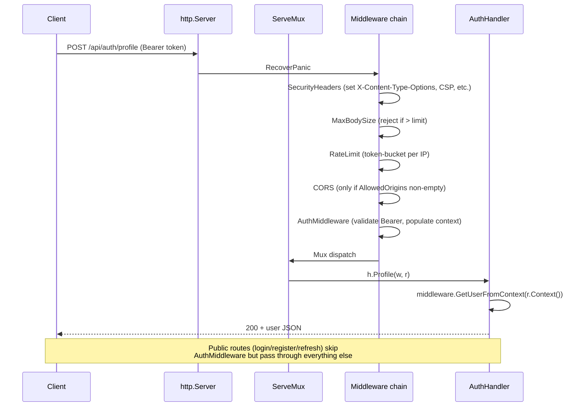
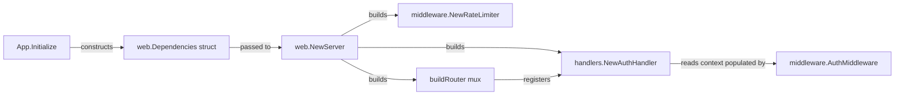

# Wire the Web Router (T2-1)

## Summary

Replace `internal/web/server.go`'s stub mux (which serves only `/health` and a static welcome page) with a real router that:

- Registers all six `AuthHandler` endpoints (login, register, logout, refresh, profile, change-password) with method+pattern routing.
- Applies a single coherent middleware stack: `RecoverPanic → SecurityHeaders → MaxBodySize → RateLimit → CORS (optional) → AuthMiddleware (per-route)`.
- Serves static assets from `web/static/` via `http.FileServer`.
- Replaces the welcome page with a minimal HTML stub describing the API surface (no real dashboard yet — that's T2-3).

The work is largely **wiring of code that already exists and is already tested**. The handler (`internal/web/handlers/auth.go`, 274 lines) and middleware (auth, errors, ratelimit, security — 459 lines combined) are implemented and have passing tests. The current `server.go` (101 lines) just doesn't reference them.

This unblocks T2-2 (data-model REST handlers — they need a router to register on) and T2-3 (templates pipeline — it needs a working request flow to render into).

---

## Problem Frame

`internal/core/app.go:Initialize` constructs `*web.Server` via `web.NewServer(cfg, logger)` but never registers any services on it. `web.Server.Start` builds an `http.NewServeMux()` inline that registers two routes:

| Route | Handler | What it does |
|---|---|---|
| `/health` | inline closure | Returns `200 OK` body `"OK"` |
| `/` | inline closure | Returns the literal HTML `<h1>ZeroDayBuddy</h1><p>Welcome…</p>` |

Meanwhile, in `internal/web/handlers/`:

- `AuthHandler` exposes six methods: `Login`, `Register`, `Logout`, `RefreshToken`, `Profile`, `ChangePassword` — none reachable from the running server.

In `internal/web/middleware/`:

- `AuthMiddleware`, `OptionalAuth`, `RequireRole`, `RequireAuth`, `AdminOnly`, `UserOrAdmin` — auth ladder.
- `ErrorHandler`, `RecoverPanic` — error and panic handling.
- `NewRateLimiter().Middleware()` — per-IP rate limiting.
- `SecurityHeaders`, `CORS`, `MaxBodySize` — security headers, CORS, body-size limits.

None of this middleware is mounted on the running server. The `lint`/`test`/`govulncheck` baseline is now clean (post-PRs #16/#17/#18), so this PR's diff is the wiring change in isolation.

`web/templates/` exists but is **empty**. `web/static/{css,js,img}/` exist but are also **empty**. Real template rendering and asset content is T2-3 work; this plan sets up the loading infrastructure so T2-3 only adds files.

`pkg/config.WebServerConfig` already has fields for `JWTSecret`, `JWTIssuer`, `EnableTLS`, `TLSCertFile`, `AllowedOrigins` — meaning the CORS allow-list is already config-driven; just needs to be passed to the middleware.

---

## Requirements Trace

From `docs/brainstorms/codebase-punch-list-requirements.md`:

- **T2-1** Wire web handlers + middleware into `server.go` → **U1, U2, U3, U4**

Origin success criterion (paraphrased): `curl http://localhost:8080/api/auth/login` does something other than 404. After this plan, that endpoint accepts POST with username/password and returns either a token (on valid creds) or a structured error.

Origin's stated middleware order (`RecoverPanic → SecurityHeaders → RateLimit → Auth (per-route)`) is honored; the plan adds `MaxBodySize` between `SecurityHeaders` and `RateLimit` (cheap to apply early so oversized bodies don't consume rate-limit budget) and `CORS` after rate-limit when `AllowedOrigins` is non-empty (skipped otherwise).

---

## Key Technical Decisions

### D1. Use `net/http` enhanced ServeMux (Go 1.22+); no router library

Go 1.22 added method+pattern routing to the standard library: `mux.HandleFunc("POST /api/auth/login", h.Login)`. Since `go.mod` is on Go 1.25 (post-PR #17), this is available.

Considered alternatives:
- **chi** — popular minimalist router with grouping. Rejected because the codebase has only ~7 direct deps (excluding spf13/cobra family) and the standard library now covers our needs.
- **gorilla/mux** — was archived 2022, then revived; less recommended.

The cost of the standard library: per-route middleware composition is verbose. Mitigated by U2's middleware-chain helper.

### D2. Add a small middleware-chain helper

Composing `func(http.Handler) http.Handler` middlewares manually requires nested wrapping. A small helper:

```text
chain(handler, mw1, mw2, mw3)  →  mw1(mw2(mw3(handler)))
```

makes the route registrations in U3 readable. Lives in `internal/web/middleware/chain.go`. ~10 lines plus tests.

This is intentionally NOT a feature-rich router — just composition. If routing needs grow beyond what enhanced ServeMux supports, revisit chi adoption then.

### D3. Pass dependencies via a `Dependencies` struct, retire `RegisterService` map

The existing `Server.RegisterService(name string, service interface{})` is unused (no callers in the repo) and untyped. Replace it with a typed `Dependencies` struct passed to `NewServer`:

```go
type Dependencies struct {
    AuthService *auth.Service
    // future T2-2 additions: ProjectStore, HostStore, etc.
}
```

`App.Initialize` constructs `Dependencies` and passes it. `NewServer` builds the `AuthHandler` from `deps.AuthService` and the logger.

Why: type safety, easier extension for T2-2's data-model handlers, removes the dead `services map[string]interface{}` field.

### D4. Wire all six AuthHandler endpoints, not just the brainstorm-named three

Brainstorm mentioned `/api/auth/login`, `/api/auth/refresh`, `/api/auth/logout`. The handler also exposes `Register`, `Profile`, `ChangePassword`. Wire all six:

| Method | Path | Handler | Auth required? |
|---|---|---|---|
| POST | `/api/auth/login` | `Login` | No |
| POST | `/api/auth/register` | `Register` | No |
| POST | `/api/auth/refresh` | `RefreshToken` | No (uses refresh token in body) |
| POST | `/api/auth/logout` | `Logout` | Yes |
| GET | `/api/auth/profile` | `Profile` | Yes |
| POST | `/api/auth/change-password` | `ChangePassword` | Yes |

`Profile` and `ChangePassword` already call `middleware.GetUserFromContext` — they assume `AuthMiddleware` populated the context. Wiring them without `AuthMiddleware` would 401 inappropriately or panic on nil-user dereference.

### D5. Bearer-token auth only; no cookie or login-form HTML

The `AuthHandler.Login` returns a JSON body with the token (per the existing handler implementation). The `AuthMiddleware` extracts `Authorization: Bearer <token>`. This is API-style auth — sufficient for `curl`, `httpie`, or a custom JS client.

A browser-friendly cookie-based flow (set-cookie on login, read-cookie on subsequent requests) and an HTML login form are deferred to T2-3 or later. T2-1's success means the API surface is reachable; the UX layer is its own concern.

### D6. Index page is a minimal HTML stub describing the API surface

Replace the current `<h1>ZeroDayBuddy</h1>` welcome with a minimal HTML page that says "ZeroDayBuddy API is running" and links to `/health` and shows the available `/api/*` endpoints. No CSS, no JS — `web/static/css/`, `js/`, `img/` are all empty. T2-3 introduces a real dashboard.

The minimal HTML must work with the strict CSP set by `SecurityHeaders` (`default-src 'self'`) — no inline scripts, no inline styles, no external fonts. Plain semantic HTML only.

### D7. Add `.gitkeep` to empty `web/static/{css,js,img}/` so the dirs survive U4's commit

These dirs currently exist on disk (and in main) but contain no files. Once we mount `http.FileServer` rooted at `web/static/`, the dirs need to keep existing or `git checkout` of the branch will erase them and break the file-server start. `.gitkeep` is the conventional placeholder file.

---

## High-Level Technical Design

This illustrates the intended request-flow shape and middleware ordering, and is directional guidance for review, not implementation specification. The implementing agent should treat it as context, not code to reproduce.

### Request flow with middleware chain



### Middleware chain composition (per-route)

```text
publicChain  = RecoverPanic → SecurityHeaders → MaxBodySize → RateLimit → CORS?
authedChain  = publicChain → AuthMiddleware
staticChain  = RecoverPanic → SecurityHeaders → CORS?  (no rate-limit; static is cheap)
```

`CORS?` means CORS is only inserted when `cfg.AllowedOrigins` has entries; otherwise the middleware is omitted from the chain to avoid sending CORS headers when no origins are whitelisted.

### Dependency wiring



---

## Implementation Units

### U1. Replace `RegisterService` with typed `Dependencies` struct

**Goal:** Give `web.NewServer` a typed dependency struct so the router (U3) can wire concrete handlers without reaching through `interface{}` lookups. Retire the dead `RegisterService` API.

**Requirements:** T2-1 (foundational — blocks U3).

**Dependencies:** None.

**Files:**
- `internal/web/server.go` (modify): change `NewServer(cfg, logger)` signature to `NewServer(cfg, deps Dependencies, logger)`; add `Dependencies` struct; remove `services map[string]interface{}` field and `RegisterService` method
- `internal/core/app.go` (modify): in `Initialize`, construct `web.Dependencies{AuthService: a.authSvc}` and pass to `NewServer`
- `internal/web/server_test.go` (new file): tests covering NewServer constructor with deps + lifecycle (Start/Shutdown)

**Approach:**
- Define `web.Dependencies` as an exported struct in `internal/web/server.go` (same package as `Server`).
- Initial fields: `AuthService *auth.Service`. Comment in the struct that future tiers (T2-2) will add `ProjectStore`, `HostStore`, etc.
- `App.Initialize` already creates `a.authSvc` before `a.webSvc = web.NewServer(...)` — just thread it through.
- The current `RegisterService` and `services` field have no callers in the repo (`grep -rn "RegisterService"` returns only the definition site). Delete cleanly.

**Patterns to follow:**
- The same constructor-injection pattern is used by `auth.NewService(authStore, jwtSecret, jwtIssuer, logger)` in `internal/core/app.go:115`.
- `recon.NewService(store, toolsConfig, logger)` and other services in `App.Initialize` follow the same pass-deps-as-args style.

**Test scenarios:**
- **Happy path:** `NewServer` constructed with non-nil `Dependencies.AuthService` returns a non-nil `*Server`; `Start` then `Shutdown` completes without error in the goroutine.
- **Edge case:** `NewServer` with `Dependencies{}` (zero value, nil `AuthService`) — should it return an error or accept it? The plan-time call: accept it (route registration in U3 will skip handler registration when `AuthService` is nil, allowing tests to construct minimal servers without auth). Document this decision in the code comment.
- **Integration:** `App.Initialize` followed by `App.Serve` with a cancel-immediately context exits cleanly without panic; the existing `TestServeWithCustomHostPort` and `TestServeWithoutInit` in `internal/core/app_test.go` keep passing.

**Verification:**
- `grep -n "RegisterService\|services\s*map" internal/web/` returns nothing.
- `go test ./internal/web/... ./internal/core/... -count=1` green.
- A new `Server.deps` field of type `Dependencies` exists and is non-nil after `NewServer`.

---

### U2. Middleware-chain composition helper

**Goal:** Provide a small helper that composes `func(http.Handler) http.Handler` middlewares into a single wrapper, so U3's route registration reads as one ordered list per route.

**Requirements:** T2-1.

**Dependencies:** None.

**Files:**
- `internal/web/middleware/chain.go` (new): `Chain(handler http.Handler, middlewares ...func(http.Handler) http.Handler) http.Handler`
- `internal/web/middleware/chain_test.go` (new): tests for ordering, empty middleware list, single middleware

**Approach:**
- Helper applies middlewares in reverse so that `Chain(h, mw1, mw2, mw3)` produces a request flow of `mw1 → mw2 → mw3 → h` (the same order the caller reads in source). This matches the request-flow reading order, which is the most common bug source in middleware composition.
- Document the order convention in a doc comment on `Chain`.
- ~10 lines total. No external deps.

**Patterns to follow:**
- Existing middleware functions in `internal/web/middleware/` all return `func(http.Handler) http.Handler` — Chain consumes that signature directly.

**Test scenarios:**
- **Happy path:** `Chain(h, mw1, mw2)` invokes `mw1` first, then `mw2`, then `h`. Verify by middleware that prepends to a context value or response header in known order.
- **Edge case — empty middleware list:** `Chain(h)` returns a wrapper equivalent to `h` (request reaches handler with no transformation).
- **Edge case — single middleware:** `Chain(h, mw1)` is equivalent to `mw1(h)`.
- **Edge case — short-circuit:** A middleware that does NOT call `next.ServeHTTP` halts the chain; verify the inner handler is not invoked.
- **Edge case — middleware that mutates context:** Confirm context mutations propagate through subsequent middlewares and reach the handler.

**Verification:**
- All test scenarios pass.
- `go vet ./internal/web/middleware/...` clean.

---

### U3. Replace stub mux with real router; wire all six auth routes with middleware

**Goal:** The `Server.Start` method builds a real router that registers all six AuthHandler endpoints with the correct per-route middleware stack, plus `/health`. Public routes use the public chain; authenticated routes add `AuthMiddleware`.

**Requirements:** T2-1.

**Dependencies:** U1, U2.

**Files:**
- `internal/web/server.go` (modify): factor out `buildRouter()` from `Start`; register routes; build middleware chains
- `internal/web/server_test.go` (modify): integration tests for each route — status codes, middleware presence (security headers, rate-limit on burst), auth required vs public

**Approach:**
- Add a private `buildRouter() http.Handler` method on `*Server` that returns the fully-wired router.
- Build middleware chain factories from `Server` fields (logger, rate limiter, deps.AuthService) at construction time:
  - `s.publicChain = []func(http.Handler) http.Handler{ middleware.RecoverPanic(s.logger), middleware.SecurityHeaders(s.logger), middleware.MaxBodySize(maxBodyBytes, s.logger), s.rateLimiter.Middleware() }`
  - Append `middleware.CORS(s.config.AllowedOrigins, s.logger)` only when `len(s.config.AllowedOrigins) > 0`.
- Construct `authHandler := handlers.NewAuthHandler(s.deps.AuthService, s.logger)`. Skip route registration when `s.deps.AuthService == nil` (logged warning) so tests can build minimal servers.
- Register routes using Go 1.22 method+pattern syntax:
  - `mux.Handle("POST /api/auth/login", middleware.Chain(http.HandlerFunc(authHandler.Login), s.publicChain...))`
  - Similarly for register and refresh.
  - Authenticated routes wrap with `AuthMiddleware`: `middleware.Chain(http.HandlerFunc(authHandler.Logout), append(s.publicChain, middleware.AuthMiddleware(s.deps.AuthService, s.logger))...)`
- `/health` keeps its current behavior but routes through `publicChain` (so the rate limiter sees health-check traffic).
- Replace inline mux construction in `Start` with `s.server.Handler = s.buildRouter()`.
- Pick reasonable `maxBodyBytes` constant (e.g., 1 MB for auth endpoints, plenty of headroom).

**Patterns to follow:**
- The existing `internal/web/middleware/auth.go:AuthMiddleware` shows the `func(http.Handler) http.Handler` shape that all middlewares conform to.
- Each `AuthHandler` method has signature `func(w http.ResponseWriter, r *http.Request)` — wrap with `http.HandlerFunc(...)` to satisfy `http.Handler`.

**Test scenarios** (the implementer will write these as integration tests with a real `httptest.Server`):

- **Happy path — login:** `POST /api/auth/login` with valid JSON body returns 200 + token; `Authorization: Bearer <token>` then succeeds against `GET /api/auth/profile`.
- **Happy path — health:** `GET /health` returns 200 "OK" and includes `X-Content-Type-Options: nosniff` (proves middleware ran).
- **Happy path — public registration:** `POST /api/auth/register` with valid body returns 201 (or whatever the handler returns).
- **Edge case — wrong method:** `GET /api/auth/login` returns 405 Method Not Allowed (Go 1.22 ServeMux behavior; verify).
- **Edge case — missing path:** `GET /nonexistent` returns 404.
- **Error path — auth required:** `GET /api/auth/profile` without `Authorization` header returns 401 with `Authorization header required` body.
- **Error path — bad bearer format:** `GET /api/auth/profile` with `Authorization: Basic xxx` returns 401 with `Invalid authorization header format`.
- **Error path — expired/invalid token:** `GET /api/auth/profile` with a known-bad token returns 401 with `Invalid or expired token`.
- **Error path — body too large:** `POST /api/auth/login` with a body larger than maxBodyBytes returns 413.
- **Error path — rate limit:** Rapid bursts of requests from same IP eventually return 429 (configurable threshold).
- **Integration — security headers on all responses:** `X-Content-Type-Options`, `X-Frame-Options: DENY`, `Content-Security-Policy: default-src 'self'`, `Referrer-Policy` all present on responses to `/health`, `/api/auth/login`, and `/api/auth/profile`.
- **Integration — CORS opt-in:** With `cfg.AllowedOrigins = []` (default), no `Access-Control-Allow-Origin` header on responses; with `cfg.AllowedOrigins = ["http://localhost:3000"]` and request `Origin: http://localhost:3000`, that header IS present.
- **Integration — RecoverPanic:** Register a temporary route that panics; confirm response is 500 (not connection-reset) and the panic is logged.
- **Integration — middleware order:** Security headers are present on a 401 response (proves SecurityHeaders ran before AuthMiddleware short-circuited).

**Verification:**
- All test scenarios pass.
- `curl -X POST http://localhost:8080/api/auth/login` (with the server running locally) returns either 400 (missing body) or a structured error — NOT 404.
- `curl http://localhost:8080/health` returns 200 with security headers.
- The `Server.deps.AuthService == nil` skip-path is exercised by a separate test (no auth routes registered, but `/health` and static still work).

---

### U4. Static asset serving + minimal index HTML stub

**Goal:** Mount `/static/*` to a `http.FileServer` rooted at `web/static/`. Replace the welcome HTML at `/` with a minimal stub describing the API surface, written to be CSP-clean (no inline JS/CSS).

**Requirements:** T2-1.

**Dependencies:** U3 (server.go is being restructured).

**Files:**
- `internal/web/server.go` (modify): add `/static/` and `/` route registrations to `buildRouter()`
- `internal/web/server_test.go` (modify): tests for static-asset 404 (no files yet), static-prefix stripping, index page content
- `web/static/css/.gitkeep` (new): preserve empty dir
- `web/static/js/.gitkeep` (new): preserve empty dir
- `web/static/img/.gitkeep` (new): preserve empty dir

**Approach:**
- For `/static/*`: `http.StripPrefix("/static/", http.FileServer(http.Dir("web/static")))`. Wrap in a non-rate-limited middleware chain (RecoverPanic + SecurityHeaders + CORS-if-enabled). No body-size or rate-limit needed — static is GET-only and cheap.
- For `/`: register a small `http.HandlerFunc` that writes a minimal HTML stub. The stub:
  - Uses `<!DOCTYPE html>` and a single `<style>` block? **No** — the strict CSP from SecurityHeaders (`default-src 'self'`) blocks inline styles. Either move CSS to a `web/static/css/index.css` file (T2-3 territory; not adding here) or skip styling entirely. **Skip styling entirely** for now — plain semantic HTML.
  - Lists available endpoints: `/health`, `/api/auth/login`, `/api/auth/register`, etc. (read-only documentation, not interactive).
  - Notes that the dashboard UI is forthcoming (T2-3).
- The `web/static/{css,js,img}/.gitkeep` files ensure the directories survive in git so the file server can start without erroring on missing dirs.

**Patterns to follow:**
- Standard Go pattern: `http.Handle("/static/", http.StripPrefix("/static/", http.FileServer(http.Dir("web/static"))))`.
- The existing welcome handler in `internal/web/server.go:53-64` shows the inline-HTML pattern; the new index follows the same shape but with API documentation as content.

**Test scenarios:**
- **Happy path — index:** `GET /` returns 200 + Content-Type `text/html`; body contains the string `ZeroDayBuddy` and lists at least the `/api/auth/login` endpoint.
- **Happy path — static placeholder:** `GET /static/css/.gitkeep` returns 200 (empty body but file exists). This proves the file server is mounted and prefix-stripped correctly.
- **Edge case — static directory listing:** `GET /static/` returns 403 or a directory listing? Default `http.FileServer` lists directories. Decide: explicitly disable directory listings (return 404 for directory-only requests) for security.
- **Edge case — path traversal:** `GET /static/../../../etc/passwd` is rejected by `http.FileServer`'s built-in cleanup — verify by test.
- **Edge case — non-existent file:** `GET /static/missing.css` returns 404.
- **Error path — root path mismatch:** `GET /unknown-page` returns 404 (handled by mux, not the index handler).
- **Integration — security headers on static responses:** `GET /static/css/.gitkeep` includes the same security headers (CSP, X-Frame-Options) as API responses.

**Verification:**
- `curl http://localhost:8080/` returns the API-documentation stub HTML (not "Welcome").
- `curl http://localhost:8080/static/css/.gitkeep` returns 200.
- The HTML stub validates against the CSP — no inline scripts or styles. Verifiable by loading in a browser with devtools open and seeing zero CSP violation warnings.
- `find web/static -type f -name '.gitkeep'` returns three files.

---

## System-Wide Impact

| Surface | Before | After |
|---|---|---|
| Web server reachability | `/health`, `/` only | `/health`, `/`, `/static/*`, `/api/auth/*` (six endpoints) |
| AuthHandler usage | Implemented but unreachable | Fully wired and tested via integration tests |
| Middleware stack usage | Implemented but unreachable | Active on every web request |
| `web.NewServer` signature | `NewServer(cfg, logger)` | `NewServer(cfg, deps, logger)` — minor breaking change to the constructor (no external callers) |
| `web.Server.RegisterService` | Public but unused | Removed |
| Default port behavior | 8080 serves stub | 8080 serves real auth API + static |
| Security headers | Not set (no middleware on stub mux) | Set on every response |
| Rate limiting | Not active | Active per-IP |
| CORS | Not active | Opt-in via `cfg.AllowedOrigins` |

**Affected parties:**
- **CLI users** — unchanged. The `serve` command keeps starting the same server; just now actually useful.
- **Future contributors writing handlers (T2-2)** — get a clear pattern: add field to `Dependencies`, construct handler in `buildRouter()`, register route with appropriate chain.
- **Anyone running the server externally** — needs to know the API endpoints exist (documented via the index page stub and via the README, eventually).
- **Operators** — security headers and rate-limit defaults shape behavior. CORS off by default.

---

## Scope Boundaries

**In scope:**
- All work described in U1-U4.

### Deferred to Follow-Up Work

- **Data-model REST handlers** (projects, hosts, endpoints, findings, tasks) — T2-2. Will register on the same router with the same middleware chains; this plan establishes the pattern.
- **Real templated dashboard UI** with HTML templates and rendered data — T2-3. Requires populating `web/templates/` and adding `html/template` parsing.
- **Cookie-based auth flow** — login form sets a cookie, browser sends it on subsequent requests. Bearer-only suffices for API + curl + custom JS clients in T2-1 scope.
- **Frontend assets** (real CSS/JS in `web/static/`) — T2-3.
- **Per-route fine-grained rate limits** (e.g., stricter on `/api/auth/login` to throttle brute-force) — current plan applies one global rate limit across all dynamic routes. Refinement is straightforward post-T2-1.
- **OpenAPI / API docs generation** — possibly a future Tier 4 polish item.
- **`SetProxyEnabled(true)` wiring** — `AuthHandler` exposes this for X-Forwarded-For-aware IP extraction behind a reverse proxy; not configured by default. Add when an actual proxy deployment surfaces.
- **TLS configuration end-to-end test** — `server.go` has the `EnableTLS` branch but no integration test exercises it. Out of T2-1 scope; deferred to a small test-only PR if/when needed.

### Not chasing

- Multi-user RBAC beyond what `AuthMiddleware` already provides.
- Plugin system, ML, alternate DB backends — explicitly out of scope per brainstorm.
- Migration to chi or another router library — D1 chose stdlib; revisit only if routing needs grow.
- Authentication via OAuth/OIDC — the current `auth.Service` is bcrypt + JWT. Out of scope.

---

## Open Questions

1. **`maxBodyBytes` default** — the plan uses MaxBodySize but doesn't specify the limit. Recommend 1 MB for general API endpoints, with finer per-route limits added later if needed. Implementer decides at execution time; document in a constant with a comment.
2. **Static directory listing behavior** — `http.FileServer` defaults to directory indexes. The plan recommends disabling them (return 404 for `GET /static/`). Implementer confirms by checking the test scenario; can use `http.NotFoundHandler` wrapper or a custom file system that hides directories.
3. **Health endpoint placement under middleware** — the plan routes `/health` through `publicChain` (so it gets security headers and rate-limit). Some setups exempt `/health` from rate-limit so monitors don't get throttled. Defer-to-implementation: if local testing shows monitoring tools tripping the limiter, exempt `/health` then.
4. **CORS preflight on `/api/auth/*`** — the existing `CORS` middleware handles `OPTIONS` preflight. Verify with a test scenario that browser preflight succeeds when `AllowedOrigins` is configured.

---

## Risk Analysis & Mitigation

| Risk | Likelihood | Impact | Mitigation |
|---|---|---|---|
| Middleware order bug (e.g., RateLimit before RecoverPanic) | Low | Medium — panics could leak before recovery; rate-limit might consume request before security headers set | Per-test verification of headers on 401/500 responses (U3 test scenarios) |
| Nil-pointer panic if `Dependencies.AuthService` is nil and a route is hit | Low | Medium | Guard route registration in `buildRouter()`; skip auth-route registration when nil; log a startup warning |
| CSP breaks the index page if any inline style/script sneaks in | Medium | Low | Index stub written with no inline styles/scripts (D6); test confirms no CSP violations |
| Static file server lists directories or allows path traversal | Low | High — info disclosure | Test scenarios for directory-listing and traversal in U4 |
| Change to `NewServer` signature breaks existing tests | High | Low — easy fix | Update tests in same PR; no external callers exist (verified via grep) |
| Go 1.22 method routing syntax has surprising precedence | Low | Low | Test each route's method-mismatch case; confirms 405 response semantics |

---

## Verification Gate

The plan is complete when **all** of the following pass:

```text
1. go build ./...                                     # clean
2. go test ./... -count=1 -race                       # all packages green; new server tests included
3. golangci-lint run --timeout=3m                     # zero issues at pinned v1.64.8
4. curl -i http://localhost:8080/health               # 200, security headers present
5. curl -i -X POST http://localhost:8080/api/auth/login # NOT 404; returns either 400 (no body) or structured error
6. curl -i http://localhost:8080/static/css/.gitkeep  # 200
7. curl -i http://localhost:8080/                     # 200 with API-documentation HTML, NOT the old welcome stub
8. grep -n "RegisterService\|services\s*map" internal/web/   # empty (D3 cleanup)
```

Steps 4-7 require a locally-running server with `./zerodaybuddy serve` from a fresh `init`.

---

## Suggested Commit Boundary

Four commits in one PR, one per unit:

1. `refactor(web): typed Dependencies struct replaces RegisterService map (T2-1 U1)`
2. `feat(middleware): add Chain helper for composing http.Handler middlewares (T2-1 U2)`
3. `feat(web): wire AuthHandler routes with middleware stack (T2-1 U3)`
4. `feat(web): serve static assets and minimal index HTML stub (T2-1 U4)`

Each unit's commit message references both the U-ID and T2-1 for traceability.
