# Data-Model REST Handlers (T2-2)

## Summary

Build the read/write HTTP API surface for the five core data entities — projects, hosts, endpoints, findings, tasks — on top of the router and middleware stack T2-1 (PR #19) established. Roughly 13 endpoints across 5 handler files, each registered via the existing `Server.publicChain` / `Server.authedChain` pipeline.

The work is mostly mechanical: wrap existing `storage.Store` methods in HTTP handlers with role-scoped auth and consistent JSON shapes. The architectural decisions (URL hierarchy, role enforcement layer, response envelope) account for most of this plan's content; the per-handler implementation is convention-following.

This unblocks T2-3 (templates pipeline / dashboard UI — needs data endpoints to render against) and T3-1 (manual project mode — needs the project create endpoint).

---

## Problem Frame

`internal/web/server.go:buildRouter()` (post-PR #19) registers the six `AuthHandler` endpoints, the `/health` and `/` index routes, and `/static/*`. None of the application's domain entities — projects, hosts, endpoints, findings, tasks — are reachable via HTTP. The CLI is the only interface to the data; web users have no way to browse projects, monitor scan progress, or triage findings without dropping into SQL.

`internal/storage.Store` already exposes the data interface this PR needs:

| Entity | Available methods | T2-2 endpoints |
|---|---|---|
| Project | Create, Get, GetByName, Update, List, Delete | List, Get, Create, Delete |
| Host | Create, Get, Update, List(byProject), Delete | List(byProject), Get |
| Endpoint | Create, Get, Update, List(byHost), ListByProject, Delete | List(byProject), Get |
| Finding | Create, Get, Update, List(byProject), Delete | List(byProject), Get, PATCH |
| Task | Create, Get, Update, List(byProject), Delete | List(byProject), Get |
| Report | Create, Get, List(byProject), Delete | (deferred — not in T2-2 scope) |

`internal/auth.User` already carries `Role` (admin / user / readonly) and `HasPermission(requiredRole)`. `middleware.AuthMiddleware` populates the user on the request context. T2-2 doesn't need new auth machinery — just to use what exists.

`web.Dependencies` (introduced in T2-1) currently holds `{AuthService, StaticDir}`. T2-2 adds a `Store storage.Store` field; `App.Initialize` wires `a.store` through.

---

## Requirements Trace

From `docs/brainstorms/codebase-punch-list-requirements.md`:

- **T2-2** Data-model REST handlers → **U1, U2, U3, U4, U5, U6**

Origin success criterion: GET endpoints for projects/hosts/endpoints/findings/tasks return JSON; POST creates a project; DELETE removes a project; mutation endpoints for findings allow status change and severity override.

After this PR: a logged-in user with a bearer token can list, fetch, create, and delete projects via JSON API; can browse the hosts/endpoints/findings/tasks discovered for any project; can triage findings by changing status or severity. The CLI continues to work unchanged.

---

## Key Technical Decisions

### D1. Mix-mode REST URL shape (nested for parent-scoped lists, flat for by-id)

The `storage.Store` signatures dictate the natural shape:

- `ListHosts(ctx, projectID)` — entries are inherently project-scoped
- `ListEndpoints(ctx, hostID)` and `ListEndpointsByProject(ctx, projectID)` — both shapes available
- `ListFindings(ctx, projectID)`, `ListTasks(ctx, projectID)` — project-scoped
- `Get*(ctx, id)` — IDs are UUIDs, globally unique

Going with mix-mode:
- **List under parent**: `GET /api/projects/{pid}/hosts`, `/findings`, `/tasks`, `/endpoints`
- **Single by id**: `GET /api/hosts/{id}`, `/api/findings/{id}`, etc.
- **Project root**: `GET /api/projects`, `POST /api/projects`, `GET /api/projects/{id}`, `DELETE /api/projects/{id}`

Considered alternatives:
- **Pure nested** (`/api/projects/{pid}/hosts/{hid}`) — verbose; requires loading parent on every single-entity request even though the host's ID alone is unique.
- **Pure flat with query params** (`/api/hosts?project_id=X`) — less discoverable; query-param-as-required-arg is awkward; loses URL-as-document-identity.

Mix-mode honors REST hierarchy where the data model has it, and goes flat where the storage layer does. This is the same shape GitHub's API uses (`/repos/{org}/{repo}/issues` for list, `/issues/{id}` for individual cross-repo lookup).

### D2. Findings mutation as unified `PATCH /api/findings/{id}`

Brainstorm calls for "status change, severity override". Two URL shapes considered:

- **Sub-resource per field**: `PATCH /api/findings/{id}/status`, `PATCH /api/findings/{id}/severity`
- **Unified PATCH with allow-listed fields**: `PATCH /api/findings/{id}` with body `{"status": "...", "severity": "..."}`

Going with **unified PATCH**. Rationale:

1. Atomicity — a triager who wants to mark a finding as "false-positive" AND "info severity" gets one round-trip and one audit entry.
2. REST-idiomatic — PATCH is the canonical "update some fields" verb.
3. Explicit allow-list at the handler — only `status` and `severity` are honored; other fields in the body are ignored. This prevents accidental escalation (e.g., "client tried to PATCH `cvss` but the handler doesn't allow it").
4. Easy to extend — adding "assignee" later is a one-line allow-list change, not a new endpoint.

Document the allow-list in the handler. Reject requests where the body is empty or contains only ignored fields with 400.

### D3. Per-route role enforcement inline in handlers (not via middleware)

`internal/web/middleware/auth.go` exposes `AuthMiddleware`, `RequireRole(role, logger)`, `RequireAuth`, `AdminOnly`, `UserOrAdmin`. Two patterns considered:

- **Middleware ladder**: chain `AuthMiddleware → RequireRole(RoleAdmin)` for each admin-only route
- **Inline check**: in the handler, call `middleware.GetUserFromContext(r.Context())` and check `user.HasPermission(auth.RoleAdmin)` directly

Going with **inline in handlers**. Rationale:

1. Most handlers need user context anyway (to log who did what, to scope writes); fetching the User then checking permission is one line.
2. Middleware-per-permission means N route registrations × M roles = chain explosion.
3. Inline lets handlers carry route-specific logic (e.g., "users can DELETE projects they created; admins can DELETE any") without a custom middleware per rule.
4. The role check returns the same 403 response shape across all handlers — easy to add via the U2 helper.

`AuthMiddleware` still wraps every authed route; per-route role checks happen inside the handler body.

### D4. Per-handler `RegisterRoutes(mux, ...)` method called from `buildRouter`

T2-1 registered all six auth routes inline in `buildRouter()`. With 13+ new routes, that approach makes `buildRouter` hundreds of lines and forces a single-file evolution.

Going with: each handler file (`projects.go`, `hosts.go`, etc.) exposes a `RegisterRoutes(mux *http.ServeMux, public, authed []func(http.Handler) http.Handler)` method. `buildRouter` calls each handler's `RegisterRoutes` after constructing it.

This:
1. Keeps route definitions next to handler implementation (cohesion).
2. Reduces `buildRouter` to a thin wiring file.
3. Makes per-handler tests easy — instantiate the handler, call RegisterRoutes against an isolated mux, exercise.
4. Mirrors the pattern from popular Go web frameworks (chi's `Routes()`, gin's group registration).

### D5. Response helpers in a new `internal/web/handlers/response.go`

T2-1's `AuthHandler` uses `http.Error(w, msg, status)` for errors and inline `json.NewEncoder(w).Encode(v)` for success. Across 13 endpoints, this becomes inconsistent — different error shapes, different status-code use. Adding three helpers prevents the drift:

- `writeJSON(w, status int, v any)` — sets `Content-Type: application/json`, `WriteHeader(status)`, encodes; logs encode errors but continues
- `writeError(w, status int, code string, msg string)` — wraps a structured error response: `{"error": {"code": "...", "message": "..."}}`
- `decodeJSON(r, v any)` — wraps `json.NewDecoder(r.Body).Decode(v)` with the project's standard 1 MiB body limit (already enforced by `MaxBodySize` middleware) and returns a typed error suitable for `writeError`

The auth handler keeps using its current pattern (no need to migrate it in this PR); new handlers consistently use the helpers. `writeError`'s structured shape is forward-compatible — clients can switch on `error.code` to render translated messages or distinguish "not found" from "permission denied" without parsing the message string.

### D6. Pagination intentionally deferred

`storage.Store` returns full slices with no offset/limit. Adding pagination requires either:

- (a) Changing the interface to add `(offset, limit int)` to every List* method — invasive, breaks all existing callers (CLI, services).
- (b) Fetching the full slice and slicing in the handler — works but wastes memory for large lists and doesn't actually reduce DB load.

Neither is acceptable for v1. Pagination becomes its own plan (likely a Tier 4 polish item) when finding lists routinely exceed ~1000 entries. Until then, all-or-nothing list responses are acceptable for the expected scale (a project typically has dozens of hosts and hundreds of findings, not millions).

Document this in the API: list responses include the full result set; paginate later.

### D7. Reports deferred from T2-2

Brainstorm T2-2 lists projects/hosts/endpoints/findings/tasks. Reports are different:

- Different storage interface shape (no `UpdateReport`)
- Generated artifacts, not raw data
- Already have a `report.Service` with `CreateReport`, `GenerateMarkdown`, etc. — exposing them via REST means designing the generation-vs-fetch dichotomy

Defer to a separate PR. Add as `Deferred to Follow-Up Work`.

### D8. Hosts, endpoints, and tasks are read-only

These entities are created by the recon and scan services running asynchronously, not by users. Exposing POST/PUT for them would either:
- Allow users to inject fabricated data (security risk for triage)
- Require a separate "manual host" model (scope expansion)

Read-only is correct for v1. `DELETE /api/hosts/{id}` could be a future admin escape-hatch but isn't called for in the brainstorm.

---

## High-Level Technical Design

This illustrates the intended structure and is directional guidance for review, not implementation specification.

### URL surface

```text
                                              auth     role check
GET    /api/projects                          authed   none (any user)
POST   /api/projects                          authed   user|admin
GET    /api/projects/{id}                     authed   none
DELETE /api/projects/{id}                     authed   admin

GET    /api/projects/{id}/hosts               authed   none
GET    /api/hosts/{id}                        authed   none

GET    /api/projects/{id}/endpoints           authed   none
GET    /api/endpoints/{id}                    authed   none

GET    /api/projects/{id}/findings            authed   none
GET    /api/findings/{id}                     authed   none
PATCH  /api/findings/{id}                     authed   user|admin

GET    /api/projects/{id}/tasks               authed   none
GET    /api/tasks/{id}                        authed   none
```

13 endpoints. ReadOnly users hit the GETs only; writes (POST/DELETE/PATCH) require user-or-admin role; project deletion is admin-only.

### Handler dependency wiring

```mermaid
flowchart LR
    App[App.Initialize] -->|Dependencies&#123;Store, AuthService, StaticDir&#125;| NewServer
    NewServer -->|s.deps.Store| BR[buildRouter]
    BR -->|store, logger| PH[ProjectsHandler]
    BR -->|store, logger| HH[HostsHandler]
    BR -->|store, logger| EH[EndpointsHandler]
    BR -->|store, logger| FH[FindingsHandler]
    BR -->|store, logger| TH[TasksHandler]
    PH & HH & EH & FH & TH -->|RegisterRoutes mux, chains| Mux[mux]
```



### Response shape

Success — bare entity for single, bare slice for list:

```text
GET /api/projects/abc-123  → 200 + {Project}
GET /api/projects          → 200 + [{Project}, {Project}, ...]
POST /api/projects         → 201 + {Project}
DELETE /api/projects/abc   → 204 + (empty body)
```

Error — structured envelope:

```text
404 + {"error": {"code": "not_found", "message": "project abc not found"}}
403 + {"error": {"code": "forbidden", "message": "admin role required"}}
400 + {"error": {"code": "invalid_body", "message": "..."}}
500 + {"error": {"code": "internal", "message": "internal server error"}}
```

---

## Output Structure

```text
internal/web/handlers/
├── auth.go            (existing, unchanged)
├── auth_test.go       (existing, unchanged)
├── response.go        (NEW — U2: writeJSON, writeError, decodeJSON)
├── response_test.go   (NEW — U2 tests)
├── projects.go        (NEW — U3: ProjectsHandler + RegisterRoutes)
├── projects_test.go   (NEW — U3 tests)
├── hosts.go           (NEW — U4: HostsHandler)
├── hosts_test.go      (NEW — U4 tests)
├── endpoints.go       (NEW — U4: EndpointsHandler)
├── endpoints_test.go  (NEW — U4 tests)
├── tasks.go           (NEW — U4: TasksHandler)
├── tasks_test.go      (NEW — U4 tests)
├── findings.go        (NEW — U5: FindingsHandler with PATCH)
└── findings_test.go   (NEW — U5 tests)
```

`internal/web/server.go` gains a `Store` field on `Dependencies` (U1) and per-handler RegisterRoutes calls in `buildRouter` (U6).

---

## Implementation Units

### U1. Add `Store` to `web.Dependencies`; thread `a.store` through `App.Initialize`

**Goal:** Make the storage layer reachable from the web handlers via the existing typed dependency-injection pattern.

**Requirements:** T2-2 foundational.

**Dependencies:** None (relies on T2-1 patterns already in main).

**Files:**
- `internal/web/server.go` (modify): add `Store storage.Store` field to `Dependencies` struct; document
- `internal/core/app.go` (modify): include `Store: a.store` in the `web.Dependencies` literal in `Initialize`
- `internal/web/server_test.go` (modify): update any tests that need to construct Dependencies (`newTestServer` helper accepts nil Store; new helper `newTestServerWithStore(t, store)` may be added if tests need it for U6)

**Approach:**
- Mirror `AuthService`'s pattern: optional field, document that "when nil, data-model routes are not registered" (parallel to AuthService skip-when-nil).
- `App.Initialize` already creates `a.store` before `a.webSvc = web.NewServer(...)` — just thread it through.
- Same package layout — `internal/web/server.go` already imports `internal/auth`; add `internal/storage` import.

**Patterns to follow:**
- T2-1's `Dependencies.AuthService` (`internal/web/server.go`) shows the exact shape.
- T2-1's `App.Initialize` Dependencies literal in `internal/core/app.go` is the wiring site.

**Test scenarios:**
- **Happy path**: `NewServer` with `Dependencies{Store: storeMock}` returns non-nil Server; `s.deps.Store` is the passed store.
- **Edge case**: `Dependencies{}` (no Store) — Server constructs without panic; subsequent route registration in U6 will skip data routes (verified there).
- **Integration**: `App.Initialize` passes `a.store` through; verified by an existing core test that calls Initialize and accesses `app.webSvc.deps.Store` (would need a small accessor or unexported field check).

**Verification:**
- `grep "Store storage.Store" internal/web/server.go` returns the new field.
- `go test ./internal/web/... ./internal/core/...` green.

---

### U2. Response and request helpers (`writeJSON`, `writeError`, `decodeJSON`)

**Goal:** Provide three small helpers in `internal/web/handlers/response.go` that the entity handlers (U3-U5) use uniformly. Standardizes JSON encoding, error envelope shape, and request-body decoding.

**Requirements:** T2-2 foundational; consumed by U3-U5.

**Dependencies:** None.

**Files:**
- `internal/web/handlers/response.go` (new)
- `internal/web/handlers/response_test.go` (new)

**Approach:**
- `writeJSON(w http.ResponseWriter, status int, v any, logger *utils.Logger)` — sets `Content-Type: application/json; charset=utf-8`, calls `WriteHeader(status)`, encodes via `json.NewEncoder(w).Encode(v)`. On encode error: logs and continues (response is already partially written; nothing to recover).
- `writeError(w http.ResponseWriter, status int, code string, msg string, logger *utils.Logger)` — wraps the structured error envelope `{"error": {"code": code, "message": msg}}` and delegates to `writeJSON`. Standard codes: `not_found`, `forbidden`, `invalid_body`, `invalid_field`, `conflict`, `internal`, `unauthorized` (auth handler uses plain `http.Error` for unauthorized; new handlers can use `writeError` for consistency in their own routes).
- `decodeJSON(r *http.Request, v any)` — wraps `json.NewDecoder(r.Body).Decode(v)`. Returns the raw decode error on failure (handler decides whether to translate to 400 invalid_body or pass through). Caller is responsible for closing the body via the standard request lifecycle.
- All three helpers take a logger so encode/decode errors can be logged centrally.

**Patterns to follow:**
- The encode-error logging pattern from T2-1's auth handler post-fix (PR #19): `if err := json.NewEncoder(w).Encode(...); err != nil { logger.Error(...) }`.
- No external libraries — `encoding/json` is sufficient.

**Test scenarios:**
- **Happy path — writeJSON**: encoding a struct returns 200 + correct Content-Type + body matches expected JSON.
- **Happy path — writeError**: returns the documented envelope shape with code and message; status code matches the passed value.
- **Edge case — writeJSON with nil**: writes "null" JSON literal (standard `encoding/json` behavior); doesn't panic.
- **Edge case — writeJSON with non-encodable type** (e.g., `chan int`): logs an error; the response status is already set (the WriteHeader happened before encoding tried), so the test asserts the status was written and an error was logged.
- **Happy path — decodeJSON**: valid body decodes into the target struct.
- **Error path — decodeJSON with invalid JSON**: returns a non-nil error; target struct unchanged.
- **Error path — decodeJSON with empty body**: returns `io.EOF`; caller can detect.
- **Error path — decodeJSON with extra fields**: by default, `encoding/json` ignores unknown fields. Document this; do not enable `DisallowUnknownFields()` (which would break clients sending forward-compat fields).

**Verification:**
- All test scenarios pass.
- `grep -n "writeJSON\|writeError\|decodeJSON" internal/web/handlers/` shows the helpers exported and the tests covering them.

---

### U3. Projects handler — full CRUD

**Goal:** Implement `ProjectsHandler` in `internal/web/handlers/projects.go` covering List, Get, Create, and Delete. Wire role enforcement inline via `auth.User.HasPermission`.

**Requirements:** T2-2 (project CRUD).

**Dependencies:** U1 (Store in Dependencies), U2 (response helpers).

**Files:**
- `internal/web/handlers/projects.go` (new)
- `internal/web/handlers/projects_test.go` (new)

**Approach:**

Endpoints:

| Method | Path | Behavior | Auth |
|---|---|---|---|
| `GET` | `/api/projects` | List all projects via `store.ListProjects(ctx)`; 200 + `[]Project` | any user |
| `POST` | `/api/projects` | Decode body (Project shape minus server-set fields); validate; `store.CreateProject(ctx, p)`; 201 + Project | user or admin |
| `GET` | `/api/projects/{id}` | `store.GetProject(ctx, id)`; 200 + Project, or 404 | any user |
| `DELETE` | `/api/projects/{id}` | `store.DeleteProject(ctx, id)`; 204 | admin only |

`ProjectsHandler` constructor: `NewProjectsHandler(store storage.Store, logger *utils.Logger) *ProjectsHandler`.

Method `RegisterRoutes(mux *http.ServeMux, authedChain []func(http.Handler) http.Handler)`:
- Wraps each handler method via `middleware.Chain(handlerFn, authedChain...)`
- Registers with method+pattern: `mux.Handle("GET /api/projects", ...)`, etc.
- Uses Go 1.22 path parameters: `r.PathValue("id")` to extract `{id}`

Inside Create / Delete handlers:
1. Pull `user := middleware.GetUserFromContext(r.Context())`.
2. Check `user.HasPermission(auth.RoleUser)` (Create) or `auth.RoleAdmin` (Delete).
3. If insufficient: `writeError(w, 403, "forbidden", "...")`.
4. Otherwise proceed.

Validate inputs in Create:
- `Name` non-empty and matches existing `validation.ProjectName` rules.
- `Platform` is "hackerone", "bugcrowd", "immunefi", or "manual" (validation.go has a list — reuse).
- `Scope` is parseable but otherwise pass-through; comprehensive scope validation is T3-1/T3-2 territory.
- Server-set fields (`ID`, `CreatedAt`, `UpdatedAt`) ignored from request body; the storage layer assigns IDs via `uuid.New().String()` (existing pattern in `internal/storage/store.go:CreateProject`).

For Delete: don't worry about cascading deletes here — `storage.DeleteProject` already handles the cascade (FOREIGN KEY clauses in migrations). If it returns an integrity error, surface 409 conflict.

**Patterns to follow:**
- T2-1's `AuthHandler.Login` pattern: `http.MethodPost` check, decode JSON body, validate, sanitize, call service, encode response.
- `internal/core/app.go:CreateProject` for understanding how the CLI creates projects (uses `platform.GetProgram` to fetch scope; the HTTP version skips this since scope is in the request body).
- `validation.ProjectName` already exists for name format validation.

**Test scenarios:**
- **Happy path — list empty**: `GET /api/projects` against an empty store returns 200 + `[]`.
- **Happy path — list non-empty**: Create two projects, list, expect both in response.
- **Happy path — get by id**: Create, fetch by id, response matches.
- **Happy path — create**: Valid POST returns 201 with the created project (including server-assigned ID).
- **Happy path — delete by admin**: DELETE as admin user returns 204; subsequent GET returns 404.
- **Edge case — create with empty name**: 400 invalid_field.
- **Edge case — create with invalid platform**: 400 invalid_field.
- **Edge case — get nonexistent id**: 404 not_found.
- **Edge case — delete nonexistent id**: 404 not_found (or 204 idempotent — pick one and document; recommend 404 because the client likely wants to know).
- **Edge case — delete with project id in URL but record has children**: depends on storage's cascade behavior; if cascade succeeds, 204; if it errors, 409 conflict.
- **Error path — create with malformed JSON**: 400 invalid_body.
- **Error path — create as readonly user**: 403 forbidden.
- **Error path — delete as user (non-admin)**: 403 forbidden.
- **Error path — any endpoint without bearer token**: 401 unauthorized (handled by AuthMiddleware before reaching the handler — verified in router_test.go integration test, not duplicated here).
- **Integration — create then list shows the new entry**: full round-trip via httptest.
- **Integration — delete then get returns 404**.

**Verification:**
- All test scenarios pass.
- `go test ./internal/web/handlers/... -count=1 -run TestProjects` green.

---

### U4. Read-only handlers for hosts, endpoints, and tasks

**Goal:** Three structurally identical handler files providing list-by-project and get-by-id for hosts, endpoints, and tasks. No write operations (per D8).

**Requirements:** T2-2 (read-only GETs for hosts/endpoints/tasks).

**Dependencies:** U1, U2.

**Files:**
- `internal/web/handlers/hosts.go` (new)
- `internal/web/handlers/hosts_test.go` (new)
- `internal/web/handlers/endpoints.go` (new)
- `internal/web/handlers/endpoints_test.go` (new)
- `internal/web/handlers/tasks.go` (new)
- `internal/web/handlers/tasks_test.go` (new)

**Approach:**

Each handler is structurally identical:

| Handler | Endpoints |
|---|---|
| `HostsHandler` | `GET /api/projects/{id}/hosts`, `GET /api/hosts/{id}` |
| `EndpointsHandler` | `GET /api/projects/{id}/endpoints`, `GET /api/endpoints/{id}` |
| `TasksHandler` | `GET /api/projects/{id}/tasks`, `GET /api/tasks/{id}` |

For endpoints' list under project, use `store.ListEndpointsByProject(ctx, projectID)` (the project-flat method, not the per-host one). The per-host list (`GET /api/hosts/{id}/endpoints`) is potentially nice but not in T2-2's stated scope — defer.

All three handlers:
- Constructor `New<Entity>Handler(store storage.Store, logger *utils.Logger)`
- `RegisterRoutes(mux, authedChain)` registering both routes via `middleware.Chain`
- No role gating — all reads available to any authenticated user (including readonly)
- 404 when the parent project or the entity doesn't exist
- 200 + JSON array for list (empty array for no entries, not 204 — list endpoints should always return arrays per REST convention)
- 200 + JSON object for single entity

The boilerplate similarity is intentional: each file is ~70 lines, mostly mechanical. If the third file feels too redundant by execution time, consider extracting a small generic helper, but don't pre-abstract before the duplication is visible (per CLAUDE.md "rule of three").

**Patterns to follow:**
- U3's `ProjectsHandler` provides the constructor + `RegisterRoutes` template.
- `r.PathValue("id")` for both `{pid}` (parent project id) and `{id}` (entity id) — Go 1.22 standard.

**Test scenarios** (per handler — adjust entity names):
- **Happy path — list under project**: Create a project, create entities under it via the storage layer directly, GET the list endpoint, verify all returned.
- **Happy path — list with no entries**: 200 + `[]` (NOT 204).
- **Happy path — get by id**: Create entity, GET by id, response matches.
- **Edge case — list under nonexistent project**: should the handler 404 first (verify project exists) or just return `[]`? Recommend: just return `[]` — list endpoints don't require parent existence verification (avoids extra DB round trip; client can `GET /api/projects/{id}` separately to check existence).
- **Edge case — get by nonexistent id**: 404 not_found.
- **Integration — recon-style population**: Create a project, simulate recon-service inserts, list returns them.

For the third handler in this batch, consider whether the test-scenario list can be tightened to a smaller core set after the first two confirm the pattern. Don't pad scenarios that are mechanically identical.

**Verification:**
- All scenarios pass for each handler.
- `go test ./internal/web/handlers/... -count=1 -run "TestHosts|TestEndpoints|TestTasks"` green.

---

### U5. Findings handler — read + PATCH mutation

**Goal:** Implement `FindingsHandler` covering List, Get, and PATCH (status / severity update). PATCH uses the unified-allow-list pattern from D2.

**Requirements:** T2-2 (findings read + mutation).

**Dependencies:** U1, U2.

**Files:**
- `internal/web/handlers/findings.go` (new)
- `internal/web/handlers/findings_test.go` (new)

**Approach:**

Endpoints:

| Method | Path | Behavior | Auth |
|---|---|---|---|
| `GET` | `/api/projects/{id}/findings` | List via `store.ListFindings(ctx, projectID)` | any user |
| `GET` | `/api/findings/{id}` | `store.GetFinding(ctx, id)` | any user |
| `PATCH` | `/api/findings/{id}` | Decode allow-listed fields; merge into existing; `store.UpdateFinding(ctx, finding)` | user or admin |

PATCH body shape (allow-list):
- `status`: optional, must be one of `models.FindingStatus*` constants
- `severity`: optional, must be one of `models.FindingSeverity*` constants

Handler logic for PATCH:
1. Fetch current finding via `store.GetFinding(ctx, id)`. If 404 → 404.
2. Decode body into a struct with optional pointer fields (so unset fields are distinguishable from zero values).
3. If both fields are nil → 400 invalid_body "no allowed fields to update".
4. Validate each provided field against the model constants. Reject with 400 invalid_field if invalid.
5. Apply the changes onto the fetched finding.
6. Set `finding.UpdatedAt = time.Now()` (or rely on the storage layer if it handles this — verify in U5 against `store.UpdateFinding` behavior).
7. Call `store.UpdateFinding(ctx, finding)`.
8. Return 200 + updated finding.

Document the allow-list in a code comment so the next contributor knows where to add new mutable fields.

**Patterns to follow:**
- U3's role-check inline pattern.
- Existing `models.FindingStatus*` and `models.FindingSeverity*` constants in `pkg/models/models.go` for validation.
- `internal/storage/finding.go:UpdateFinding` for understanding what the storage layer does with the passed finding (in particular, whether it updates `UpdatedAt` itself).

**Test scenarios:**
- **Happy path — list**: Create finding(s), GET list, all returned.
- **Happy path — get by id**: created finding fetched correctly.
- **Happy path — patch status only**: PATCH `{"status": "triaged"}` changes status; response shows new value; severity unchanged.
- **Happy path — patch severity only**: PATCH `{"severity": "high"}` similarly.
- **Happy path — patch both**: PATCH `{"status": "...", "severity": "..."}` changes both atomically.
- **Edge case — patch with empty body**: 400 invalid_body "no allowed fields".
- **Edge case — patch with only ignored fields** (e.g., `{"title": "different"}`): 400 invalid_body "no allowed fields" — title is not in the allow-list, so the request effectively had no allowed updates.
- **Edge case — patch with invalid status value**: 400 invalid_field "status".
- **Edge case — patch with invalid severity value**: 400 invalid_field "severity".
- **Edge case — patch nonexistent id**: 404 not_found.
- **Error path — patch as readonly user**: 403 forbidden.
- **Error path — patch with malformed JSON**: 400 invalid_body.
- **Integration — patch then get returns updated value**.
- **Integration — patch is atomic when both fields valid**: storage layer either commits both or neither (if the storage UpdateFinding is transactional).

**Verification:**
- All scenarios pass.
- `go test ./internal/web/handlers/... -count=1 -run TestFindings` green.

---

### U6. Wire all handlers in `buildRouter`; add integration test for the full data API surface

**Goal:** Connect U3-U5 handlers to the running server. Add an integration test in `internal/web/router_test.go` that exercises representative endpoints end-to-end through the full middleware stack.

**Requirements:** T2-2 wiring.

**Dependencies:** U1, U2, U3, U4, U5.

**Files:**
- `internal/web/server.go` (modify): in `buildRouter`, after auth-route registration block, add data-handler construction + RegisterRoutes calls
- `internal/web/router_test.go` (modify): add data-API integration tests (route-registration smoke checks; full happy-path: login → create project → list)

**Approach:**

In `buildRouter`, after the existing auth-route block, add:

```text
if s.deps.Store == nil {
    s.logger.Warn("Store is nil; skipping data-model route registration")
    return s.applyCORS(mux)
}

projectsHandler := handlers.NewProjectsHandler(s.deps.Store, s.logger)
projectsHandler.RegisterRoutes(mux, authedAuth)

hostsHandler := handlers.NewHostsHandler(s.deps.Store, s.logger)
hostsHandler.RegisterRoutes(mux, authedAuth)

// ...endpoints, findings, tasks similar
```

Pass `authedAuth` (the existing authed chain) to all handlers — they all require authentication; per-route role gating is internal to the handler.

For tests:
- Existing `newTestServerWithAuth(t)` already wires Store-less auth-only setup. Add `newTestServerWithStoreAndAuth(t)` that wires both.
- Add `TestRouter_AllDataRoutesRegistered` similar to T2-1's auth-route registration test — list every new route, GET/POST against it, confirm not-404.
- Add `TestRouter_NilStoreSkipsDataRoutes` — Dependencies with AuthService but no Store; data routes 404; auth routes still work.
- Add one happy-path integration test: login as a fresh user → POST /api/projects → GET /api/projects/{id} → DELETE.
- Add `TestRouter_AdminRequiredForProjectDelete` — DELETE as RoleUser returns 403; DELETE as RoleAdmin returns 204.

**Patterns to follow:**
- T2-1's auth-route registration block in `buildRouter` (PR #19).
- T2-1's `TestRouter_AllSixAuthRoutesRegistered` for the route-registration smoke test pattern.
- `setupAuthBackend(t)` in `internal/web/router_test.go` for the in-memory SQLite + auth.Service helper. Will need a sibling `setupStorageBackend(t)` that sets up the application's storage.Store on the same DB (or a separate one).

**Test scenarios:**
- **Happy path — all 13 routes registered**: each returns something other than 404 with valid bearer token.
- **Edge case — Store nil**: AuthService set but Store nil; data routes 404; auth routes still work.
- **Integration — full project lifecycle**: login → POST project (as user) → list (as user, expect 1 entry) → DELETE (as admin) → list (as user, expect 0 entries).
- **Integration — readonly user can list and get but not create**: login as readonly, GET list 200, POST 403.
- **Integration — admin-required for project delete**: login as user, DELETE returns 403; login as admin, DELETE 204.
- **Integration — all 13 routes go through middleware stack**: pick one route per entity, verify security headers + body-size limit applied (proves wiring matches the auth-route pattern).

**Verification:**
- All integration tests pass.
- `gh pr checks` (when PR is open): all CI checks green except the upstream Go 1.25.10 security check (which we know is unrelated).
- Live `curl http://localhost:8080/api/projects -H "Authorization: Bearer <token>"` returns JSON.

---

## System-Wide Impact

| Surface | Before | After |
|---|---|---|
| Web API endpoints | 6 (auth) + 3 (health/index/static) | 19+ — adds 13 data endpoints across 5 entities |
| `web.Dependencies` shape | `{AuthService, StaticDir}` | `{AuthService, StaticDir, Store}` |
| `internal/web/handlers/` files | 1 (`auth.go`) | 6 — adds projects, hosts, endpoints, findings, tasks, response helpers |
| `Server.buildRouter` complexity | Inline route registration | Per-handler `RegisterRoutes` calls |
| Error response shape across handlers | Inconsistent (auth uses `http.Error`) | Standardized via `writeError` for new handlers; auth handler unchanged in this PR |
| Role enforcement | Middleware-only (`AuthMiddleware`) | Per-route inline role checks (`user.HasPermission`) on writes |
| CLI behavior | unchanged | unchanged |

**Affected parties:**
- **Web UI** (T2-3, future) — has data to render; this is the API the dashboard will call.
- **Operators** running scans — gain HTTP visibility into in-flight tasks via `GET /api/projects/{id}/tasks`.
- **Future contributors writing handlers** (T3-1, etc.) — get a clear template to follow: response helpers, RegisterRoutes pattern, inline role checks.
- **API consumers** (curl, scripts, future client libraries) — get a stable JSON contract.

---

## Scope Boundaries

**In scope:**
- 13 endpoints across the 5 named entities (projects, hosts, endpoints, findings, tasks).
- Response/request helpers (`writeJSON`, `writeError`, `decodeJSON`).
- Per-route role enforcement for writes.
- Wiring through `buildRouter` and integration tests.

### Deferred to Follow-Up Work

- **Reports endpoints** — `Reports` has a different storage shape (`Create` returns the report; no `Update`) and ties to the `report.Service` generation pipeline. Worth its own design pass.
- **Bulk-create endpoints** (`POST /api/projects/{id}/hosts:bulk`, etc.) — `storage.BulkCreate*` methods exist but exposing them via REST adds API-design questions (response shape for partial failures, idempotency keys). Defer until there's a concrete client need.
- **Pagination** (`?limit=`, `?cursor=`) — invasive change to the storage interface. Add when list sizes warrant it.
- **OpenAPI spec generation** — could be added as a separate PR; introducing OpenAPI tooling is its own decision.
- **WebSocket / SSE for real-time scan progress** — T4-2 in the brainstorm.
- **Per-host endpoint listing** (`GET /api/hosts/{id}/endpoints`) — `storage.ListEndpoints(hostID)` exists but the list-by-project covers most use cases; add when a UI-driven need surfaces.
- **`PUT /api/projects/{id}` (full project update)** — brainstorm scope is List/Get/Create/Delete. Adding update is non-trivial because Project has nested `Scope` whose merge semantics need definition.

### Not chasing

- **Manual project creation flow validation** — T3-1 owns the "manual" platform validation logic. T2-2's POST /api/projects accepts whatever platforms the existing `validation` package allows, including "manual" once T3-1 lands.
- **Finding status workflow validation** (e.g., "can't go from Closed back to New") — T2-2 enforces value validity but not state transitions. Add as a Tier 4 polish if needed.
- **Multi-user RBAC beyond admin/user/readonly** — out of scope per brainstorm.
- **CLI changes** — CLI continues to use the storage layer directly. The HTTP API is additive.

---

## Open Questions

These are intentionally not pre-answered; the implementer resolves at execution time and notes the choice in the commit message.

1. **DELETE idempotency**: should `DELETE /api/projects/{id}` for a nonexistent id return 404 (informing the client) or 204 (idempotent)? The plan recommends 404; implementer can swap if there's a strong client preference.
2. **`UpdatedAt` stamping**: does `storage.UpdateFinding` automatically update `UpdatedAt`, or does the handler need to set it explicitly? Read `internal/storage/finding.go:UpdateFinding` at execution time to confirm.
3. **Finding mutation atomicity**: if `store.UpdateFinding` is non-transactional and a concurrent request also patches the same finding, we get last-writer-wins. Acceptable for v1? The plan assumes yes — in-process triage is rarely concurrent. Document the limitation.
4. **404 vs 200 + empty array for list under nonexistent project**: plan recommends `200 + []`, but some teams prefer a 404 for consistency with single-entity GETs. Implementer picks; document the rationale in code comment.

---

## Risk Analysis & Mitigation

| Risk | Likelihood | Impact | Mitigation |
|---|---|---|---|
| Inline role checks drift across handlers (one handler forgets to check) | Medium | Medium | The U2 helper pattern + each handler's tests covering "as readonly", "as user", "as admin" catches drift. |
| Decode-into-existing-struct overrides server-set fields (e.g., client sends `id` in body and overwrites) | High if not guarded | High (security) | In Create handlers, decode into a `request` struct (only client-settable fields), not the Model directly. Document in U3's Approach. |
| Inconsistent error envelope across new and existing handlers | Low | Low | Plan accepts that auth handler keeps its current pattern; new handlers consistently use the helper. Note in CHANGELOG. |
| `r.PathValue` returns empty string for typos (e.g., `{pid}` registered, `r.PathValue("id")` reads) | Medium during development | Low (caught by tests) | Convention: parent param is `{id}` for primary entity, `{id}` for nested too. Tests verify path extraction. |
| Per-handler RegisterRoutes signature drift (one handler accepts `[]chain`, another accepts `chain...`) | Medium | Low | Plan specifies the signature exactly: `RegisterRoutes(mux *http.ServeMux, authedChain []func(http.Handler) http.Handler)`. Lint-style review catches drift. |
| Forgetting to update `Server.applyCORS` invocation when adding routes | Low | Medium | `applyCORS` already wraps the entire mux at the end of `buildRouter` (T2-1 design); adding new routes via `mux.Handle` automatically benefits. Test verifies CORS works for one of the new routes. |
| Test fixtures (in-memory SQLite + auth + storage) get heavy and slow | Medium | Low | Reuse `setupAuthBackend(t)` pattern; if a `setupStorageBackend(t)` becomes a hotspot, factor into a shared helper. |

---

## Verification Gate

The plan is complete when **all** of the following pass:

```text
1. go build ./...                                                 # clean
2. go test ./... -count=1 -race                                   # all packages green; new handler tests included
3. golangci-lint run --timeout=3m                                 # zero issues at pinned v1.64.8
4. curl -i -H "Authorization: Bearer <token>" /api/projects       # 200 + JSON array
5. curl -X POST -H "Authorization: Bearer <token>" -d {...} /api/projects   # 201 + JSON object with assigned id
6. curl -X DELETE -H "Authorization: Bearer <admin-token>" /api/projects/{id}   # 204
7. curl -X PATCH -H "..." -d '{"status":"closed"}' /api/findings/{id}   # 200 + updated finding
8. grep -n "RegisterRoutes" internal/web/handlers/                # all 5 handlers expose RegisterRoutes
```

Steps 4-7 require a locally running server (`./zerodaybuddy serve`) and a valid bearer token (obtainable via `POST /api/auth/login` after `POST /api/auth/register`).

---

## Suggested Commit Boundary

Six commits in one PR, one per unit:

1. `feat(web): add Store to web.Dependencies; thread storage through App.Initialize (T2-2 U1)`
2. `feat(handlers): add response helpers — writeJSON, writeError, decodeJSON (T2-2 U2)`
3. `feat(handlers): projects CRUD endpoints with role-aware writes (T2-2 U3)`
4. `feat(handlers): hosts/endpoints/tasks read-only endpoints (T2-2 U4)`
5. `feat(handlers): findings read + PATCH for status/severity (T2-2 U5)`
6. `feat(web): wire data handlers in buildRouter + integration tests (T2-2 U6)`

Each unit is independently reviewable; landing them in this order keeps the tree green at every commit (U2 has no dependencies; U3 depends on U1+U2; U6 depends on all preceding).
